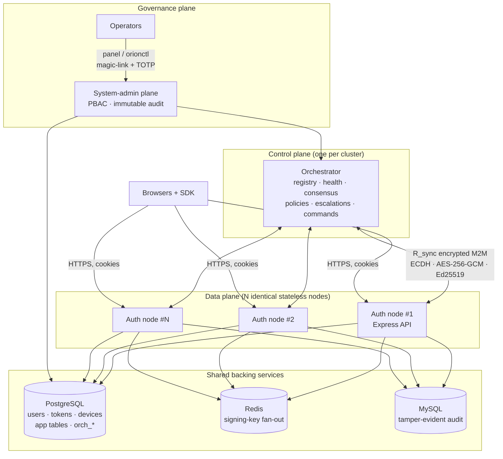
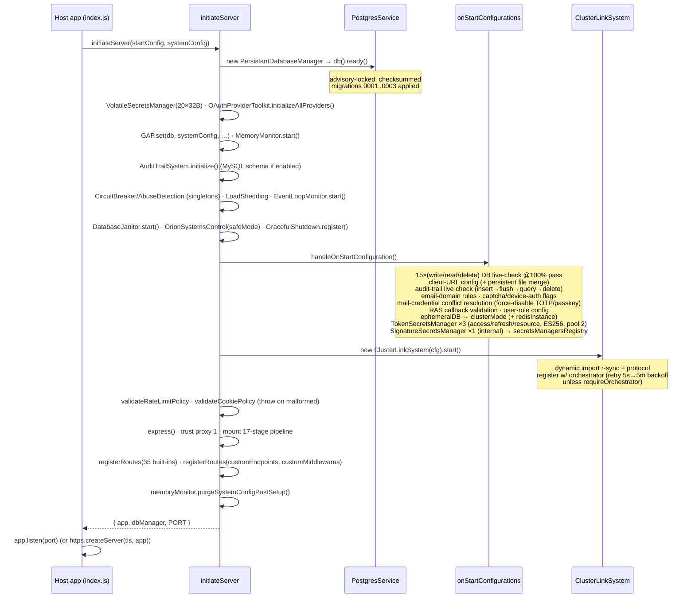
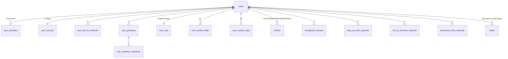
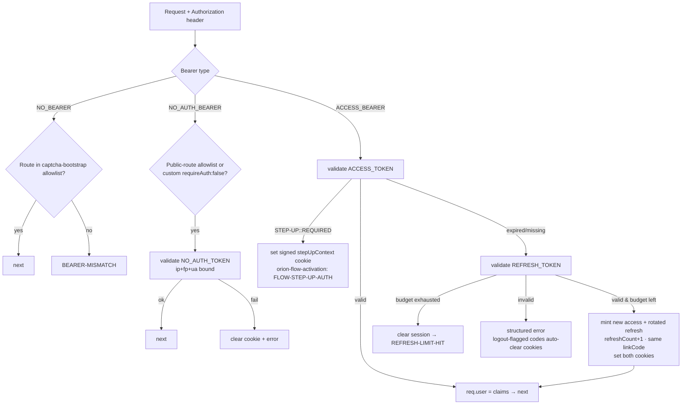

# Project Hail Mary — Internal Architecture Report

**Project:**
Orion

**Internal Codename:**
Project Hail Mary

> **Naming note.** From this point forward this document refers to the project exclusively as **Project Hail Mary**. On-disk identifiers (directory names, npm package names such as `orion-orch`, `r-sync`, `@aadharsh/orion-alpine-x934x`, file names such as `orion.config.example.js`, header names such as `orion-fingerprint`, and the API namespace `alpine`) are code-level literals and are reproduced verbatim wherever precision requires it — they are identifiers, not references to the project. Everywhere prose refers to the system as a whole, it is Project Hail Mary.

**Report status:** Canonical internal engineering specification, reverse-engineered from the complete repository source tree.
**Source of truth:** the repository working tree at `C:\Users\aadk9\OneDrive\Desktop\orion` (887 files inventoried; ~42,000 lines of first-party source excluding vendored bundles and generated artifacts).
**Audience:** future engineers, security auditors, architects, maintainers, incident responders, DevOps, and AI coding assistants.

---

## Table of Contents

1. [Executive Summary](#1-executive-summary)
2. [Codebase Map](#2-codebase-map)
3. [High-Level Architecture](#3-high-level-architecture)
4. [Entry Points](#4-entry-points)
5. [Boot Sequence and Runtime Lifecycle](#5-boot-sequence-and-runtime-lifecycle)
6. [Subsystem Deep Dive — the Core Auth Framework (`Orion-core`)](#6-subsystem-deep-dive--the-core-auth-framework-orion-core)
7. [Subsystem Deep Dive — the Cluster Control Plane (`Orion-Orchestrator`)](#7-subsystem-deep-dive--the-cluster-control-plane-orion-orchestrator)
8. [Subsystem Deep Dive — the Encrypted M2M Transport (`R_sync`)](#8-subsystem-deep-dive--the-encrypted-m2m-transport-r_sync)
9. [Subsystem Deep Dive — the Browser SDK (`Packages/client`)](#9-subsystem-deep-dive--the-browser-sdk-packagesclient)
10. [Subsystem Deep Dive — the Reference Application (`Todos-App`)](#10-subsystem-deep-dive--the-reference-application-todos-app)
11. [Database Architecture](#11-database-architecture)
12. [API Reference](#12-api-reference)
13. [Authentication and Authorization Model](#13-authentication-and-authorization-model)
14. [Configuration Reference](#14-configuration-reference)
15. [Security Review](#15-security-review)
16. [Performance Review](#16-performance-review)
17. [Error Handling and Observability](#17-error-handling-and-observability)
18. [Testing](#18-testing)
19. [Build System, Tooling, and Conventions](#19-build-system-tooling-and-conventions)
20. [Infrastructure and Deployment](#20-infrastructure-and-deployment)
21. [Retired Subsystems (the Graveyard)](#21-retired-subsystems-the-graveyard)
22. [Complete File Inventory](#22-complete-file-inventory)
23. [Technical Debt Register](#23-technical-debt-register)
24. [Inferred Roadmap and Unfinished Work](#24-inferred-roadmap-and-unfinished-work)
25. [Cross-Reference Index](#25-cross-reference-index)

---

## 1. Executive Summary

### 1.1 What Project Hail Mary is

Project Hail Mary is a **self-hosted, batteries-included authentication platform for Node.js**, built as a four-package monorepo plus a shared test suite:

1. **`Packages/server/Orion-core`** (npm: `@aadharsh/orion-alpine-x934x`, v1.0.6) — an embeddable authentication framework. A consuming Express application calls one function, `initiateServer(startConfig, systemConfig)`, and receives a fully wired Express app exposing 35 authentication endpoints (email/password, WebAuthn passkeys, OAuth against 11 providers, TOTP 2FA, device authorization, step-up auth, session management, password reset, a custom captcha bot-gate) plus the host app's own custom endpoints run through the same 17-stage security middleware pipeline. It owns its PostgreSQL schema (19 tables, versioned checksummed migrations), an optional Redis fan-out for cluster-wide JWT signing keys, and an optional MySQL tamper-evident audit trail.

2. **`Packages/server/Orion-Orchestrator`** (npm: `orion-orch`, v1.1.0) — the cluster control plane. One orchestrator process supervises N auth nodes: node registry with disk persistence, a FORMING→HEALTHY→DEGRADED→INCIDENT health state machine, fleet consensus votes, declarative alert→reaction policies, escalation channels, and an awaitable remote-command system over an allowlisted verb set. It embeds a complete **PBAC system-admin plane** — Postgres-backed admin identities (root: password+TOTP; admins: magic-link+TOTP), IAM-style deny-overrides policies, a hash-chained append-only audit table enforced by a database trigger, a statically-exported Next.js web panel shipped pre-built inside the package, and a zero-dependency CLI (`orionctl`).

3. **`Packages/server/R_sync`** (npm: `r-sync`, v1.0.0) — the encrypted machine-to-machine transport underneath the control plane. Orchestrator↔worker tunnels use ECDH (P-256/384/521) key agreement, HKDF with per-session salts, AES-256-GCM payload encryption, Ed25519 signatures, persistent worker identity keys (anti-hijack), and bidirectional replay protection. Persistence is LokiJS; admin endpoints are localhost-only.

4. **`Packages/client`** — a browser SDK (`orion.beta.sdk.js`) built with esbuild+terser from an ESM source tree: a singleton `Orion` class with auth-state observation, cookie-session handling, captcha bootstrap, device fingerprinting, WebAuthn ceremonies, and pre-built modal UI flows for device authorization and step-up auth.

5. **`Packages/apps/Todos-App`** — the first real consuming application: a static HTML/JS client, an API server embedding the core framework with four custom `/todos` routes, and a live orchestrator process. Building it against the framework surfaced and fixed four latent core bugs (§10.4), and it anchors the documented 4-box AWS reference deployment.

### 1.2 Engineering quality and maturity

- **Maturity: late-alpha, production-shaped.** The API namespace is literally `alpine` (alpha), the SDK file is `orion.beta.sdk.js`, yet the stack has been deployed live on AWS EC2 (one orchestrator box + three worker nodes behind Cloudflare tunnels — evidenced by `gipsy.deploy/` artifacts) and carries production concerns most side projects never reach: advisory-locked concurrent migrations, graceful shutdown, load shedding, circuit breakers, event-loop and memory monitors, database janitors, hash-chained audit trails, and a governed human-access plane.
- **Strengths:** exceptional documentation discipline (a 746-line deployment guide, 530- and 758-line package READMEs, an annotated config template, per-module coverage map, and even eulogy documents for removed subsystems); defense-in-depth as the default posture; a single shared protocol module preventing wire drift; hermetic no-dependency test suite (47 suites on `node:test`); disciplined secrets hygiene via the `gipsy.*` git-ignore convention.
- **Complexity:** high for its size. The core framework alone contains ~15 named "systems" (§6.7) plus a 17-stage middleware pipeline. The complexity is mostly essential (auth is adversarial by nature) but the coordination surface — a global singleton service locator (`GlobalAccessPoint`) threading everything — concentrates risk (§23).
- **Scalability:** horizontal by design — auth nodes are stateless between requests; all shared state lives in Postgres/Redis; signing keys fan out over Redis so any node validates any node's JWT; sweeps and DDL are advisory-locked so N nodes never collide. Vertical limits are those of a single Postgres (§16).
- **Single-maintainer signature:** one author (Kalivaradhan Aadharsh) across all packages; conventions are consistent but idiosyncratic (e.g. the `parameters`-object function style, `errorCode` sentinel returns instead of exceptions, misspellings preserved in API — `PersitantDatabases`, `memoryMonitioringSystem`).

### 1.3 One-paragraph mental model

An app embeds the core framework and gets a hardened auth API; browsers talk to it through the SDK using `Secure`/`SameSite=None` cookie sessions with tier-4 token binding (IP-range + device-fingerprint risk scoring); many such nodes share Postgres + Redis and become a fleet; one orchestrator process supervises the fleet over an encrypted, replay-protected transport, reacting to node alerts with declarative policies and quorum votes; and human operators drive the orchestrator only through a PBAC-governed panel/CLI whose every action lands in two append-only audit trails — one on the orchestrator, one on the node that executed the command.

---

## 2. Codebase Map

Annotated tree of everything meaningful (generated/ignored artifact families collapsed; full per-file inventory in §22):

```
orion/                                          ← repo root (Project Hail Mary)
├── DEPLOYMENT.md                               ★ End-to-end deployment guide (746 lines) — the operator's canon
├── PROJECT_HAIL_MARY_INTERNAL_ARCHITECTURE_REPORT.md   ← this document
├── .gitignore                                  ★ gipsy.*, *.log, *.db, orion.internal*, r_sync.internal.* …
├── .prettierrc.json                            Code style: 4-space, 160 cols, single quotes
├── jsconfig.json                               Editor typing: ES2022, Bundler resolution, strictNullChecks
├── .idea/ · .vscode/                           IDE metadata (JetBrains + VS Code)
├── gipsy.Orion_servers.pem                     ⚠ EC2 SSH private key (git-ignored, but on disk)
│
├── Packages/
│   ├── server/
│   │   ├── Orion-core/                         ★★★ The auth framework (npm @aadharsh/orion-alpine-x934x 1.0.6)
│   │   │   ├── index.js                        Package entry — public export surface
│   │   │   ├── lib/orion.meta.js               Version/status constants + internal file names
│   │   │   ├── lib/General/                    Central policies: rate-limit table, cookie policy, Joi schemas
│   │   │   ├── lib/Errors/                     22-module structured error registry → errors.json
│   │   │   ├── lib/Server/
│   │   │   │   ├── initiateServer.js           ★ Boot orchestration + middleware pipeline assembly
│   │   │   │   ├── onStartConfigurations.js    ★ Boot-time validation, cluster-mode, secrets managers
│   │   │   │   ├── Endpoints/index.js          ★ The 35 built-in route registrations
│   │   │   │   ├── Middleware/  (14 files)     ★ The request pipeline (§6.3)
│   │   │   │   └── Response/response.js        Uniform success/error envelope + error-code laundering
│   │   │   └── lib/Utils/
│   │   │       ├── Core/AccountManagment/      Signup, sign-in, passkeys, TOTP, password reset, profile
│   │   │       ├── Core/SecurityManagment/     Device auth, step-up, 2FA removal, captcha token, revocation
│   │   │       ├── Core/TokenManagement/       ★ Access/refresh/resource tokens + shared session engine
│   │   │       ├── Core/OAuth/                 openid-client toolkit, 11 fixed providers
│   │   │       ├── Core/ResourceAccessManagment/  ORAS: dir-, callback-, and S3-based gated resources
│   │   │       ├── Databases/                  ★ Postgres service + migrations + 9 models; Redis/local ephemeral
│   │   │       ├── Systems/  (17 files)        ★ Resilience & secrets systems (§6.7)
│   │   │       ├── Mail/                       nodemailer + text templates
│   │   │       └── (~20 leaf utils)            crypto, ip/geo, encoders, validator, sanitizer, cookies, GAP …
│   │   │
│   │   ├── Orion-Orchestrator/                 ★★★ Control plane (npm orion-orch 1.1.0)
│   │   │   ├── index.js                        Exports OrionOrchestrator + protocol + system-admin
│   │   │   ├── bin/orionctl.js                 Zero-dependency admin CLI
│   │   │   ├── lib/OrionOrchestrator.js        ★ Wires every subsystem below
│   │   │   ├── lib/protocol.js                 ★ Shared wire contract (protocol v2) — imported by BOTH sides
│   │   │   ├── lib/{NodeRegistry,RegistryStore,CommandDispatcher,PolicyEngine,
│   │   │   │        ConsensusEngine,ClusterHealth,EscalationHub}.js
│   │   │   ├── lib/SystemAdmin/                ★ PBAC plane: DB, models, PBAC engine, auth crypto,
│   │   │   │   │                                 mailer, audit log, service, HTTP server
│   │   │   │   └── migrations/0001_system_admin.sql   8 orch_* tables + immutability trigger + default policy
│   │   │   ├── gui/                            Next.js 15 / React 19 panel source (output: 'export')
│   │   │   │   └── out/                        ← committed static export served by AdminServer
│   │   │   ├── sql/worker-grants.example.sql   DB-enforced worker read-only rule
│   │   │   └── examples/orchestrator.example.js
│   │   │
│   │   └── R_sync/                             ★★ Encrypted M2M transport (npm r-sync 1.0.0)
│   │       ├── index.js                        Exports R_Sync class + crypto/date/id utils + DB accessors
│   │       ├── lib/interface.js                ★ The R_Sync class (singleton, both roles)
│   │       ├── lib/core/{server,TunnelManager}.js         Express factory; ECDH tunnels + encrypt/sign/send
│   │       ├── lib/core/controllers/ + routes/            Orchestrator/worker/ETS REST surfaces
│   │       ├── lib/core/middleware/securityMiddleware.js  ★ Signature/nonce/localhost/M2M/lockdown guards
│   │       ├── lib/utils/                      crypto (30+ fns), lokidb, logger, audit, replayGuard, ETS …
│   │       └── test/                           Package-local suites (crypto, schemas, middleware, hardening)
│   │
│   ├── client/                                 ★★ Browser SDK source
│   │   ├── index.js                            (empty file — placeholder)
│   │   ├── dist/orion.beta.sdk.js              ← committed build artifact (esbuild+terser bundle)
│   │   ├── lib/Root.js                         ★ The Orion singleton class (auth state machine)
│   │   ├── lib/Utils/                          Api fetch wrapper, captcha, vault (IndexedDB), fingerprint …
│   │   ├── lib/API-Handlers/Auth/              One module per server flow (11 modules)
│   │   ├── lib/Flows/                          Self-injecting modal UIs: DeviceAuthorization, StepUpAuth
│   │   ├── lib/External-Scripts/               Vendored: DOMPurify, WebAuthn helpers, fingerprintjs
│   │   └── gipsy.non-commitable-dev-tooling/   sdkBuilder.js (esbuild+terser) + fileWatcher.js
│   │
│   └── apps/Todos-App/                         ★★ Reference application
│       ├── README.md                           Local run + EC2 runbook + the four core bugs it exposed
│       ├── server/{index.js, orion.config.example.js, todos/}   API node (port 3900)
│       ├── orchestrator/dashboard/{server.js,index.html}        Basic-auth observability dashboard
│       │      (orchestrator/start.js referenced by docs/dashboard is ABSENT from the tree — see §23)
│       └── client/{index.html,auth.html,dashboard.html,app.js,account.js,
│                    orion-client.js,config.js,styles.css,orion.beta.sdk.js}
│
├── Testing/                                    ★★ Repo-wide suite — node:test, zero dependencies
│   ├── package.json · README.md · COVERAGE-MAP.md
│   ├── helpers/{bootstrap,mocks,fixtures}.js   bootstrap MUST be first import (cwd redirection)
│   ├── suites/server/…  (40 files) · suites/client/… (2 files)
│   ├── integration/                            Live-harness scaffolding + plan (Postgres/Redis/HTTP)
│   ├── assets/orion.beta.sdk.js                SDK copy for client suites
│   └── gipsy.test-artifacts/pid-*/             Generated per-run scratch (git-ignored)
│
├── gipsy.deploy/                               (ignored) Live AWS deploy scratch: EIPs, instance IDs, SG/VPC ids,
│                                               tunnel URLs, cookies, captcha screenshots, per-worker configs, logs
├── gipsy.experimentals/                        (ignored) The MongoDB→Postgres migration study (models + SQL + plan)
├── gipsy.Graveyard/                            (ignored) Decommission memorials: DIP + Transport Encryption Network
└── gipsy.Live-Test-Scratch-Pad/                (ignored) Pre-Todos manual test harness (legacy)
```

Importance legend used throughout: ★★★ critical to the platform, ★★ major subsystem, ★ load-bearing file.

---

## 3. High-Level Architecture

### 3.1 The four-plane model

Project Hail Mary separates concerns into four planes, each with its own trust boundary:

| Plane | Package | Carries | Trust boundary |
| --- | --- | --- | --- |
| **Data plane** | `Orion-core` | End-user auth traffic (browsers → Express API) | TLS + cookie sessions + tiered token binding |
| **Control plane** | `Orion-Orchestrator` | Fleet supervision: status, alerts, commands, consensus | R_sync tunnels (ECDH + AES-256-GCM + Ed25519) |
| **Transport plane** | `R_sync` | Encrypted event delivery between orchestrator and workers | Persistent Ed25519 identity keys; localhost-only admin |
| **Governance plane** | `Orion-Orchestrator/lib/SystemAdmin` | Human operator access to the control plane | Magic-link/password + TOTP, PBAC, dual immutable audit |



### 3.2 Architectural invariants (the rules the design keeps)

1. **Nodes are identical and stateless between requests.** Any node serves any user; a JWT minted anywhere validates everywhere because signing keys fan out over Redis. Adding capacity = starting another node with the same backing services.
2. **The orchestrator shares *control*, Redis shares *data*.** Cluster mode (Redis) and the cluster link (orchestrator) are independent, complementary systems; production runs both, either works alone.
3. **One protocol module, two importers.** `orion-orch/protocol` is imported by both the orchestrator and each node's `ClusterLinkSystem`, so event names, command verbs, consensus topics, and envelope shapes can never drift (protocol version 2; the `issuedBy` principal field is the v2 addition).
4. **Remote control is triple-gated** (transport crypto → node allowlist/`allowRemoteControl` → node-side safe mode), and safe mode is *deliberately* not remotely overridable — lifting it requires a config change and restart on the node itself.
5. **Fail loud at boot, degrade gracefully at runtime.** Misconfiguration (bad cookie policy, malformed rate-limit table, missing audit credentials, conflicting email-domain rules) throws during boot; runtime dependency failures route through circuit breakers, load shedding, and structured error codes instead of crashes.
6. **Everything a human does is attributable twice.** Panel/CLI actions produce a hash-chained orchestrator audit row *and* — via the command envelope's `issuedBy` — a node-side audit row on the worker that executed the command.
7. **Secrets never live in the tree.** The `gipsy.*` prefix is git-ignored globally; committed files hold `CHANGE_ME` templates only. Runtime-generated key material lands in `orion.internal.*` / `r_sync.internal.*` files, also ignored.

### 3.3 Design patterns in use

- **Service locator singleton** (`GlobalAccessPoint`, "GAP") in all three server packages — the central registry through which subsystems find the DB, config, secrets managers, monitors, and each other. Keys `db`, `systemConfig`, `volatileSecretsManager`, `oAuthToolKit`, `clusterMode` are write-locked after boot (with a 1-minute post-boot grace window for `systemConfig`).
- **Layered middleware pipeline** (classic Express, but strictly ordered and centrally assembled in `initiateServer.js`).
- **Template method / shared engine**: `sessionTokenCore.js` is the single engine behind both access and refresh tokens; kind-specific behavior is injected (error prefixes, lifespan keys, rotation hooks).
- **Registry pattern**: error registry (22 modules aggregated into `errors.json`), secrets-manager registry (flat list in GAP for cluster commands), route registry, PBAC action vocabulary.
- **State machines**: cluster health (FORMING/HEALTHY/DEGRADED/INCIDENT), circuit breaker (closed/open/half-open), admin sessions (`pending_totp`→`active`), admin accounts (`pending`→`active`→`suspended`).
- **Sentinel-error returns**: internal functions return `{ error: true, errorCode }` objects rather than throwing; `tryCatch` wrappers feed the Error Tracker System; only boot-time code throws.
- **Safe module wrapper** (`SafeModuleHandler` / `UnavailableModuleWrapper.js`): lazily resolves GAP-registered modules with a named-getter contract (a getter *method* must exist on GAP for the module to resolve — `setValue` alone is insufficient), tolerating boot-order gaps.

---

## 4. Entry Points

Every executable or externally-invoked entry in the repository:

| Entry | Kind | Starts |
| --- | --- | --- |
| `Packages/apps/Todos-App/server/index.js` | `node index.js` | Reference API node: loads `gipsy.orion.config.js` (refuses to boot without it), calls `initiateServer`, runs the app's own `todos` migration, serves HTTP or HTTPS (auto-detects `server.cert`/`server.key`) |
| `Packages/apps/Todos-App/orchestrator/start.js` | `node start.js` | Reference orchestrator + system-admin plane (reads `SYSTEM_ADMIN_ENABLED`, `SA_DB_*`, `SA_ROOT_*`, `SA_HTTP_*`, `SA_BASE_URL`, `SA_MAIL_*` env vars) — **referenced by all docs and by `dashboard/server.js`, but absent from the current tree** (§23, item 1) |
| `Packages/apps/Todos-App/orchestrator/dashboard/server.js` | imported by start.js | Dependency-free Basic-auth HTTP dashboard sharing the live orchestrator instance (`/api/status`, `/api/action`, …) |
| `Packages/server/Orion-Orchestrator/bin/orionctl.js` | CLI (`bin` in package.json) | Zero-dependency system-admin CLI; session in `~/.orionctl.json` (0600) |
| `Packages/server/Orion-Orchestrator/examples/orchestrator.example.js` | `npm run start:example` | Minimal orchestrator demo |
| `Packages/server/R_sync/examples/{orchestrator,worker}.example.js` | `npm run start:orchestrator` / `start:worker` | Transport-only demos |
| `Testing/` npm scripts | `npm test` etc. | `node --test "suites/**/*.test.js"` — whole repo suite |
| `Packages/server/R_sync` `npm test` | package-local | Four R_sync suites with `test/set-env.mjs` preloaded (in-memory DB) |
| `Packages/server/Orion-Orchestrator/gipsy.smoke-system-admin.mjs` | manual script (ignored) | End-to-end admin-plane smoke: bootstrap → root login → TOTP → rotation → invite → PBAC allow/deny → audit chain → DB immutability → suspension |
| `Packages/client/gipsy.non-commitable-dev-tooling/{sdkBuilder,fileWatcher}.js` | dev scripts | Build/watch the SDK bundle from `lib/` → `dist/orion.beta.sdk.js` |
| `Packages/apps/Todos-App/client/gipsy.playwright-check/drive*.mjs` | dev scripts | Headless-Chromium verification drives (signup→CRUD→relogin, with screenshots) |
| Library entries | `import` | `Orion-core/index.js`, `Orion-Orchestrator/index.js` (+ `./protocol`, `./system-admin` subpath exports), `R_sync/index.js` |
| Background/scheduled work | in-process | `DatabaseJanitor` (15-min advisory-locked sweep), secrets managers' scheduled rotation, `Cron.js` (node-cron wrapper), ClusterLink status/flag timers, admin-plane 6-hour purge timer, R_sync heartbeat timer |

There are no cloud functions, no Docker entrypoints, and no CI pipelines in the tree — deployment is bare Node processes under tmux (§20).

---

## 5. Boot Sequence and Runtime Lifecycle

### 5.1 Auth-node boot (from `initiateServer.js` + `onStartConfigurations.js`)



Load-bearing details:

- **The DB live-check is brutal by design**: 15 rounds of write→read→delete against `_orion_health_check`, requiring a **100% pass rate** (each round itself retried 3×), after a 3-second settling delay. A flaky database fails the boot.
- **Mail-credential conflict resolution** is a boot-time contract: with device authorization enabled but no SMTP credentials, the node **refuses to boot**; TOTP and passkeys are instead **force-disabled with warnings** (their deletion paths require email OTPs; registration without deletion would strand accounts).
- **`serviceID` defaults to `crypto.randomUUID()`** when unset — fine for a single node, but cluster identity should be pinned in config (the deployment guide requires it).
- **`memoryMonitioringSystem.purgeSystemConfigPostSetup()`** scrubs config copies after wiring, reducing long-lived plaintext credential surface in memory.
- **GAP locking**: after boot (+1-minute grace for `systemConfig`), the five locked keys cannot be overwritten; reads of missing locked keys throw `GAP:$:VALUE_NOT_FOUND`.

### 5.2 Shutdown

`GracefulShutdownSystem.register()` hooks process signals last, so every system is already in GAP; it drains and stops monitors/janitor/cluster link (which emits `orion:node:goodbye`, letting the orchestrator mark the node offline instantly rather than waiting for staleness). The R_sync logger deliberately does **not** own SIGINT/SIGTERM unless `R_SYNC_LOGGER_HANDLE_SIGNALS=1` (host app owns signals).

### 5.3 Orchestrator boot

`new OrionOrchestrator(config)` wires NodeRegistry (rehydrated from `orion_orch.internal.registry.json` via RegistryStore; persisted nodes start marked offline), CommandDispatcher, PolicyEngine (defaults cover every alert type), ConsensusEngine, ClusterHealth (15-second evaluation cadence), EscalationHub (log channel always on; webhook via config; custom via `addEscalationChannel`), and optionally the SystemAdmin plane (own pg pool, own migration ledger `_orch_migrations` under advisory lock `761003002`, root bootstrap on first boot, Express `AdminServer` on port 55330 serving `/api/*` + the committed `gui/out`). `start()` boots the R_sync ORCHESTRATOR role, then (default `identifyOnStart: true`) sweeps still-live tunnels with `node:identify` so the registry reflects reality within seconds of a restart.

---

## 6. Subsystem Deep Dive — the Core Auth Framework (`Orion-core`)

### 6.1 Package surface (`index.js`)

Exports: `initiateServer`, `globalAccessPoint`, `logger`, `userControl` (admin-grade user CRUD for host apps), `requestContext` (AsyncLocalStorage request metadata), and utility namespaces — `validators`, `ipUtils`, `encodersAndDecoders`, `uaParser`, `dateAndTime`, `cron`, `sanitizer`, `cookies`, `fileIO`, `tokens` (`generateResourceToken`), `oras` (`S3UrlBuilder`, `presignS3Url`), `valueGenerators`, `orionCrypto`, `orionInfo`. This surface is pinned by `Testing/suites/server/PackageSurface.test.js`.

### 6.2 Dependency rationale (all runtime deps of the core)

| Dependency | Why it exists |
| --- | --- |
| `express` v5, `helmet`, `hpp`, `cors`, `cookie-parser`, `compression`, `express-rate-limit` | HTTP framework + standard hardening + gzip (threshold 1 KB) |
| `pg` | PostgreSQL pool + migrations + models |
| `redis` | Cluster-mode signing-key fan-out (ephemeral store) |
| `mysql2` | AuditTrailSystem's tamper-evident store |
| `jsonwebtoken` | JWT sign/verify inside `jwtCodec.js` |
| `bcrypt` | Password hashing (native module) |
| `zxcvbn` | Password strength estimation at signup |
| `@simplewebauthn/server` | Passkey (WebAuthn) ceremony verification |
| `otplib`, `qrcode` | TOTP secrets/validation + enrollment QR codes |
| `openid-client` | OAuth/OIDC code flows for the 11-provider registry |
| `nodemailer` | Email OTP delivery (device auth, TOTP, password reset, 2FA removal) |
| `canvas` | Server-rendered custom captcha images (native module) |
| `geoip-lite`, `ip-to-asn`, `ipaddr.js` | IP risk scoring: geolocation, ASN lookup, range math for tier binding |
| `ua-parser-js` | Device metadata from User-Agent (device scanner) |
| `joi`, `validator` | Request-schema validation (`EndpointSchema.js`) + field validation |
| `node-cron` | `Cron.js` scheduler wrapper |
| `file-type`, `mime-types` | ORAS content-type sniffing / `X-Content-Type-Options` correctness |
| `@aws-sdk/client-s3`, `@aws-sdk/s3-request-presigner` | ORAS S3-mode presigned URLs |
| `orion-orch` (file:), `r-sync` (file:) | Protocol contract + embedded worker for the cluster link (dynamically imported — non-cluster deployments pay no cost) |

### 6.3 The middleware pipeline (order is the security model)

Assembled in `buildMiddlewarePipeline()`; order is deliberate and documented inline:

| # | Middleware | Purpose |
| --- | --- | --- |
| 1 | `globalFloodGuard` | Coarse per-IP breaker **before body parsing** (default 1000 req/min/IP) — floods are rejected before `express.json` allocates |
| 2 | `staticAssets` (opt-in) | Plain public-directory hosting, served before the auth/header stack (browser asset fetches carry no `orion-*` headers) |
| 3–8 | `express.json` (10 MB default) · `urlencoded` · `cors` (dynamic origin verifier, credentials) · `helmet` · `hpp` · `cookieParser` · `compression` | Parsing + standard hardening |
| 9 | `serverUtilitiesMiddleware` | Per-request utilities/housekeeping |
| 10 | `requestMetadataMiddleware` | AsyncLocalStorage context: requestId, IP, timing — the `requestContext` export |
| 11 | `rateLimiter.middleware` | **Edge pass** of the `DynamicGlobalRateLimiter`: IP + fingerprint actors charged against the central policy table before any expensive work |
| 12 | `serverStatusMiddlware` | Rejects traffic when the server is locked (`server.lockdown` GAP flag — the fleet-wide lock verb lands here) |
| 13 | `loadSheddingMiddleware` | Sheds when in-flight ceiling / event-loop degradation demands it |
| 14 | `resourceAccessMiddleware` | The ORAS gate (`/resource-access-oras`): resource-token validated file/S3 delivery |
| 15 | `originVerifier.verifyOrigin` | Strict origin allowlist beyond CORS (exact-match against `allowedClientUrls`) |
| 16 | `headerParser.verifyHeader` | Requires/validates the `orion-*` client headers (fingerprint, user-agent echo) |
| 17 | `abuseCheckMiddleware` | AbuseDetectionSystem verdicts (blocked actors rejected) |
| 18 | `authenticationMiddleware` | The auth core — §13.2 |
| 19 | `rateLimiter.accountMiddleware` | **Account pass**: now that `req.user` exists, the account actor is charged (no-op if unauthenticated) |
| 20 | `dataValidator` | Joi schema enforcement per endpoint (`EndpointSchema.js`) |
| 21 | `deviceCheckMiddlware` | Device scanner (ua-parser) enriching device context |

Then routes: 35 built-ins under `/{slug}/alpine/api/v1/...`, followed by host-app custom endpoints (custom middlewares filterable per-path via `{ applyAll | pathsToApply, callback }` objects).

### 6.4 Account management (`lib/Utils/Core/AccountManagment/`)

- **`CreateAccount.js`** — email/password signup: domain allowlist, zxcvbn strength, bcrypt hash, `users` + `user_security` rows, `onUserCreation` hook. (Historical bug: gated on `authMethods.passkey` instead of `emailPassword` — fixed via the reference app.)
- **`SignIn.js`** — password verification → device-recognition check → (if unknown device and device-auth enabled) email-OTP device authorization flow → access+refresh token issuance with a shared `accessTokenLinkCode` binding the pair. (Historical bug: read `user.data.credentials.uid` — a legacy-document path — instead of `user.uid`; fixed.)
- **Passkeys** (`Passkeys/`) — full WebAuthn via `@simplewebauthn/server`: registration options/verification for existing users, plus a complete **passkey-first signup** flow (`AuthFlows/SignUpWithPasskey.js`) and passkey sign-in (`AuthFlows/SignInWithPasskey.js`). Credentials in `user_passkeys` (+ transports table), counters tracked.
- **`SetupTOTP.js` / `TOTP.js`** — secret generation (stored AES-256-GCM-sealed via TOTPModel when `dataEncryption.key` is set, `enc.v1.` prefix), QR provisioning, verify-and-enable with `pending_secret` promotion.
- **`PasswordReset.js`** — email-OTP two-step (initiate/complete) with hashed codes, IP-range + UA-hash binding, real expiry column.
- **`GetUserProfile.js`**, **`SignOutUser.js`** (token revocation + cookie clearing), **`UserControl.js`** (724 lines — exported `userControl`: host-app-facing user administration: lookup, disable, role changes, custom-data/profile fields).
- **`2FA&DeviceAuthorization/DeviceAuthorization.js`** — the account-side device-authorization engine backing the security-management routes.

### 6.5 Security management (`lib/Utils/Core/SecurityManagment/`)

- **Device authorization** — first sign-in from an unrecognized device triggers an email OTP; success writes `recognized_devices` (hashed device code + UA hash + expiry). Alternative satisfiers: passkey or TOTP (`authorize-device-with-*`).
- **Step-up auth (`StepUpAuth.js`, 868 lines — largest first-party module)** — when tier risk-scoring flags drift (fingerprint/IP change), token validation returns `STEP-UP::REQUIRED::A::p`; the middleware mints a signed `stepUpContext` cookie (SignatureSecretsManager) and the response carries `orion-flow-activation: FLOW-STEP-UP-AUTH`, which the SDK's modal flow intercepts. Verifiers: email OTP, passkey, TOTP. Completion marks the request context step-up-complete for that uid.
- **`NoAuthToken.js` (captcha gate)** — pre-auth bot defense: a transaction (`no_auth_token_transactions`) binds a canvas-rendered captcha (`CustomCaptchaSystem.js`, ~300 lines: distorted text, noise, versioned) to IP-range + fingerprint + UA; solving it yields the `NO_AUTH_TOKEN` cookie that all public auth routes require (when `captcha: 'ENABLED'`).
- **`Remove2FAMethod.js`** — email-OTP-confirmed removal of TOTP/passkey methods (24-hour request expiry).
- **`SessionRevocation.js`** — list/revoke sessions grouped by link code; revocation deletes token rows, and the next use of a revoked token fails stateful validation with a logout-flagged error that auto-clears cookies.
- **`CookieReset.js`** — session-cookie clearing helper.

### 6.6 Token management (`lib/Utils/Core/TokenManagement/`)

The heart of the data plane:

- **`internals/sessionTokenCore.js`** — the shared engine for access + refresh tokens: tier-aware payload assembly, DB persistence for stateful tiers, ES256 signing via the per-domain TokenSecretsManager, and the mirrored validation pipeline (decode → key lookup by `kid` → signature → expiry → issuer-in-`server.urls` → tier binding → stateful row check).
- **`internals/tierBinding.js`** — the tier semantics: **1** stateless/no binding; **2** IP-range bind (mismatch = hard fail); **3** fingerprint as advisory risk signal; **4** IP-range + fingerprint combined risk scoring → escalate to step-up on drift. `Ip.js` supplies range/geo/ASN-based risk scoring.
- **`internals/jwtCodec.js`** — minimal JWT sign/verify bound to secrets-manager key objects; verification returns structured results (never throws).
- **`internals/tokenAudit.js`** — uniform audit envelopes for every token event.
- **`tokenFieldMap.js`** — bidirectional verbose↔compact claim-name map (token size reduction).
- **`AccessTokens.js` / `RefreshTokens.js`** — thin kind-specific wrappers. Refresh adds the rotation budget (`refreshCount`/`maxRefreshes`), expired-row sweep on rotation, and email resolution during stateful validation. (Historical bug: refresh `iss` built from `server.selfUrl` string instead of the `server.urls` array; fixed.)
- **`ResourceTokens.js`** — single-purpose grants for ORAS: embedded callback allowlist, retrieval budget (`max_retrievals`/`retrieval_count`), view-type; not tier-bound, never cookies.
- **`TokenRevocation.js` / `TokenCleanup.js`** — row-deletion revocation + sweeps.

**Key custody:** `TokenSecretsManager` (per domain: access/refresh/resource) and `SignatureSecretsManager` (domain: internal — signs step-up context and similar internal blobs) each maintain a pool of 2 ES256 keypairs generated by `SecretsCrypto.js`, rotate on schedule, and in cluster mode fan keys out through Redis so **any node verifies any node's signatures**. Cluster commands (`secrets:list-kids`, `secrets:revoke-kids`, `secrets:force-rotate`) enumerate/revoke/rotate through the flat `secretsManagersRegistry`. `VolatileSecretsManager` separately holds 20×32-byte in-memory secrets for low-stakes ephemeral needs.

### 6.7 The Systems (`lib/Utils/Systems/`) — the resilience layer

| System | Role |
| --- | --- |
| `ErrorTrackerSystem` (ETS) | Tracks every `tryCatch`-reported error by message/function/file against rolling-window thresholds; a CRITICAL trip sets the global `ETS_LOCKDOWN` flag → worker-facing traffic rejected until an operator clears it (clearing resets history by default, with a pre-reset forensic snapshot audited) |
| `CircuitBreakerSystem` | Per-dependency closed/open/half-open breakers; remotely openable, reset is safe-mode-gated |
| `LoadSheddingSystem` + `loadSheddingMiddleware` | In-flight ceiling + shed decisions; ceiling remotely settable (safe-mode-gated) |
| `EventLoopMonitor` (ELM) | Lag watcher; sets/clears `ELM_DEGRADED` (feeds health, consensus, alerts) |
| `MemoryMonitoringSystem` | Heap/system watcher; also scrubs post-boot config copies |
| `AbuseDetectionSystem` | Request-stream heuristics per actor; blocked-actor map; `abuse:unblock-actor` command |
| `DynamicGlobalRateLimiter` | Policy-table-driven token buckets per actor type (ip / fp / account) with per-route cost overrides; two pipeline passes (edge + account) |
| `AuditTrailSystem` | Hash-chained audit events, buffered, flushed to MySQL `audit_trail` + signed local WAL (`orion.internal.audit_wal.jsonl` + public key pem); boot-time integrity self-test; pause/resume safe-mode-gated |
| `DatabaseJanitor` | Advisory-locked (single sweeper per cycle), ctid-batched TTL sweeps of expired tokens/devices and abandoned flow rows; 15-min default |
| `GracefulShutdownSystem` | Signal-driven orderly teardown |
| `ClusterLinkSystem` (854 lines) | The node-side control-plane agent (§7.2) |
| `TokenSecretsManager` / `SignatureSecretsManager` / `SecretsCrypto` / `VolatileSecretsManager` | Key custody (§6.6) |
| `Snapshotter` | Transactional state snapshot/revert helper (double-revert guarded) |
| `Tracer` | Dev/debug-only tracing |
| `SystemsControl.js` (`OrionSystemsControl`) | The façade the cluster link drives: `getSystemStatus()` aggregation, lock/unlock, activate/deactivate security systems, ETS clear, audit pause/resume, breaker control — **safe mode** (config `utilities.safeMode`) gates every mutating verb |

### 6.8 Databases layer (`lib/Utils/Databases/`)

- **`PersitantDatabases/postgres.js`** *(sic — spelling is part of the API path)* — `PostgresService`: pg pool (config passthrough incl. `poolMax`, `statementTimeoutMs`, `ssl`), and the migration runner: `migrations/*.sql` applied in order, checksummed into `_orion_migrations`, serialized cluster-wide via a Postgres advisory lock (concurrent fleet boots are safe). Migrations: `0001_initial.sql` (full schema), `0002_legacy_upgrade.sql` (document-era → normalized upgrades; drops legacy mirror tables), `0003_oauth_pkce_verifier.sql` (adds `oauth_requests.code_verifier` for PKCE). `ddl.sql` is the consolidated **non-executed** reference DDL kept in sync by convention; `audit-mysql.ddl.sql` documents the MySQL audit schema.
- **Models (`models/`)** — `UserModel`, `UserSecurityModel`, `UserProviderModel`, `PasskeyModel`, `TOTPModel` (with at-rest sealing), `TokenModel`, `DeviceModel`, `RequestModel` (all pending-flow tables: device-auth, OAuth, step-up, 2FA-removal, password-reset, captcha transactions), `HealthCheckModel`. Convention: timestamps are TIMESTAMPTZ in SQL, converted to/from unix seconds (`FLOAT8`) at the query boundary.
- **`EphemeralDatabases/`** — provider factory: `LOCAL_DB` (`localMemoryDB.js`: TTL'd in-process store with clone isolation — single-node mode) or `REDIS` (`redis.js` — cluster mode). The choice **is** the `clusterMode` flag.

### 6.9 OAuth (`lib/Utils/Core/OAuth/`)

`OrionOAuthToolkit` (595 lines) wraps `openid-client` with a fixed 11-provider registry — google, github, discord, slack (OIDC "Sign in with Slack": scopes `openid email profile`), microsoft, facebook, amazon, twitter, linkedin, reddit, spotify. Custom providers are deliberately unsupported; Apple is explicitly excluded (form_post + JWT client secret don't fit the standard code flow). Per-provider fetch wrapper injects quirk headers (GitHub `Accept`, Reddit `User-Agent`) and bounds every provider call with a timeout so a slow provider cannot wedge a worker. Flow state lives in `oauth_requests` (hashed flow secret + challenge, IP-range binding, nonce, PKCE `code_verifier`); `HandleOAuthCallback.js` completes the code exchange, links `user_providers`, creates the account if novel, and issues the session pair. `Account.js` is the existence-check helper.

### 6.10 Resource Access System (ORAS) (`lib/Utils/Core/ResourceAccessManagment/`)

Token-gated resource delivery through `resourceAccessMiddleware` at `/resource-access-oras`, distinct from plain static hosting:

- **dir-based** — safe-path-resolved files from a configured directory; `fileResponse.js` sets sniffed content types, `nosniff`, inline-vs-attachment disposition.
- **callback-based (`SECURE-0`)** — host-app callbacks return `{ base64File, mimeType }`; `secureDelivery.js` enforces the resource token's callback allowlist and access-type binding; callbacks validated at boot (`callbackValidator.js`).
- **S3-based (`S3-0`)** — callbacks return metadata; `S3UrlBuilder.js` builds/presigns AWS SDK v3 URLs (host/path styles, key templating); `urlResponse.js` delivers a `no-store` JSON envelope carrying the URL instead of bytes.

### 6.11 Errors (`lib/Errors/`) and responses

22 registry modules (Account/Authentication/Communication/OAuth/Security/System groups) define every error as `DOMAIN::CODE::severity::visibility` (e.g. `TOKEN-ACCESS::EXPIRED::A::p`), with flags such as `logout: true` (respondWithError clears session cookies) and client-safe substitution codes. `internal-errors.js` aggregates all modules, enforces global uniqueness, and writes `errors.json` at import time (a filesystem side effect the test bootstrap redirects). `Server/Response/response.js` is the single response envelope: success/error shape, exposed-header management (`orion-flow-activation`, `orion-session-logout`), and sensitive-detail laundering via `clientSafeErrorCode`.

### 6.12 Leaf utilities

`CryptoFunctions.js` (hashing/bcrypt/HMAC/AES-GCM), `dedicatedCrypto.js` (RSA-OAEP transport keys — retained post-Graveyard for genuinely-needed asymmetric ops), `Ip.js` (risk-scored IP intelligence), `Encoders.js`, `Date&Time.js` (duration parsing `'15m'`/`'7d'`), `valueGenerator.js` (crypto-random IDs), `Validator.js` (incl. `validateClientUrls`), `Sanitizer.js`, `Parsers.js` (incl. `slugParser`), `CookieUtils.js` (managed cookies — attributes come only from the central `CookiePolicy.js`, callers cannot override), `Compressor.js`, `ArrayUtilities.js`, `FileHandler.js` (cwd-relative JSON/file IO for the `orion.internal.*` persistence files), `Device.js`, `Cron.js`, `logger.js` (console+file singleton with ANSI colors), `TryCatch.js` (call-site-capturing wrapper feeding ETS), `UnavailableModuleWrapper.js` (`SafeModuleHandler`), `GlobalAccessPoint.js` (§3.3).

Known wiring gotchas (verified against source): GAP consumers via `SafeModuleHandler` require a **named getter method** on the GAP class (`setValue` alone won't resolve); `logger` must be imported **before** `GlobalAccessPoint` in modules that can be a module-graph entry (circular-import resolution order — documented at the top of `ClusterLinkSystem.js`).

---

## 7. Subsystem Deep Dive — the Cluster Control Plane (`Orion-Orchestrator`)

### 7.1 Control-plane subsystems (`lib/`)

| Module | Responsibility |
| --- | --- |
| `OrionOrchestrator.js` (781) | The façade: wraps an R_sync ORCHESTRATOR, wires everything below, exposes the operator API (`getClusterStatus`, `command`, `commandAll`, `lockCluster`/`unlockCluster`, `addClientUrls`, `proposeConsensus`, `declareIncident`/`resolveIncident`, observability getters, per-node helpers `pingNode`/`getNodeStatus`/`lockNode`/`clearNodeEtsLockdown`) |
| `protocol.js` (240) | Protocol v2 contract: 7 event names, 22 command verbs, 12 alert types, 5 consensus topics, 4 cluster states, envelope builders (command envelopes carry `issuedBy`), `isKnownCommand`/`isKnownTopic` |
| `NodeRegistry.js` | Per-node identity/status/alert history (capped), stale sweep (default silent >120 s → `node:stale`), recovery detection on any authenticated traffic |
| `RegistryStore.js` | Debounced crash-safe persistence to `orion_orch.internal.registry.json`; corruption-recovering load |
| `CommandDispatcher.js` | Correlation-ID request/response over one-way events; timeouts (10 s default); **impersonation guard** — a result arriving from a different worker than addressed is discarded; audit ring (200 entries) |
| `PolicyEngine.js` (299) | Declarative `on: [alerts] → actions` rules; action types `escalate`, `verify-status`, `command`, `consensus`, `schedule-command` (delayed remediation that re-checks `onlyIfStatusFlag` before firing — never races an operator); per-(rule,node) cooldowns; `DEFAULT_POLICIES` cover every alert observability-first (auto-remediation opt-in) |
| `ConsensusEngine.js` | Quorum votes over **eligible** voters (silent nodes make acceptance harder, never easier); partition → `decided: false`, never a fake rejection; history retained |
| `ClusterHealth.js` | FORMING→HEALTHY→DEGRADED→INCIDENT; unhealthy = offline ∨ ETS lockdown ∨ ELM degraded ∨ stale status (>300 s); INCIDENT requires ratio ≥ 0.5 **and** ≥ 2 unhealthy **and** (configurable) a failed NODE_HEALTHY fleet vote — an unreachable fleet counts *for* the incident; every transition escalated + broadcast (`orion:cluster:state`) |
| `EscalationHub.js` | Channels: log (always), webhook (`{ url, headers }`), custom; per-channel isolation; ring-buffer history |
| `orch.meta.js` | Version metadata |

### 7.2 The node-side agent — `ClusterLinkSystem` (in the core framework)

Embeds an R_sync WORKER (dynamically imported so non-cluster boots pay nothing): announces `NODE_HELLO`; pushes `getSystemStatus()` snapshots every 60 s; a **fast flag watcher** (2 s default) raises edge-triggered `NODE_ALERT`s the moment ETS-lockdown/ELM/server-lock/memory-pressure flags flip (alert latency = watch interval, not report interval); executes allowlisted commands against `OrionSystemsControl` (double-gated: `allowRemoteControl` + safe mode); casts consensus ballots from its **local** view; answers `node:identify`; stores `CLUSTER_STATE` broadcasts in GAP (`clusterState()`); self-heals a desynced tunnel after 3 consecutive delivery failures by re-registering under its persistent identity key and raising `tunnel:resynced`. Registration retry backoff: 5 s → 5 m.

### 7.3 The system-admin plane (`lib/SystemAdmin/`)

- **`AdminDatabase.js`** — orchestrator-owned pg pool + versioned migrations (`_orch_migrations`, advisory lock `761003002`) — deliberately independent of the core framework's ledger so both can share one database without collision.
- **Schema (`migrations/0001_system_admin.sql`)** — 8 tables: `orch_system_admins` (roles root/admin, statuses pending/active/suspended, CHECK constraint *password only for root*), `orch_admin_policies` (JSONB documents, `managed` flag, seeded `POL_DEFAULT_READ_ONLY`), `orch_admin_groups` + `orch_admin_group_members`, `orch_admin_policy_attachments` (principal admin|group), `orch_admin_magic_links` (SHA-256 token hashes, single-use, TTL), `orch_admin_sessions` (SHA-256 bearer hashes, two-stage `pending_totp`→`active`), `orch_admin_audit` (hash-chained; **UPDATE/DELETE rejected by trigger** — append-only even for the orchestrator itself).
- **`SystemAdminService.js`** (796) — everything behind the HTTP layer: root bootstrap (first boot only; forced password rotation + TOTP enrollment before `active`), magic-link issuance/consumption, TOTP enrollment/verification (otplib + QR), session ladder, governance (**role-enforced root-only** — never merely route-guarded): admin CRUD/suspension (suspension revokes all live sessions), policy/group/attachment CRUD with document validation, and PBAC authorization for every non-governance action. 6-hour expired-row purge timer. Passwords: salted scrypt (`authCrypto.js`, node:crypto only).
- **`PBACEngine.js`** — deny-overrides, default-deny evaluation over the union of direct+group policies; `:`-segment glob matching (`*` = one segment; trailing `*` = remainder; no regex, no eval); document validation on write.
- **`adminActions.js`** — the closed action vocabulary: `cluster:read:{status,nodes,health,escalations,consensus,policy-rules,policy-outcomes,command-log}`, `cluster:ops:{lock,unlock,incident-declare,incident-resolve,consensus-propose,client-urls-add}`, `cluster:command:<node-verb>` (resource `node:<workerId>` or `*`), `audit:read`.
- **`AuditLog.js`** — hash = sha256(row + prev_hash); records **every** authenticated API request including PBAC denials, plus auth/governance events; `verify` re-walks the chain.
- **`AdminMailer.js`** — nodemailer magic-link delivery; console mode when mail is unconfigured (dev only).
- **`AdminServer.js`** (800) — Express: `/api/*` (auth, TOTP, governance, cluster read/ops/command proxy carrying `issuedBy`, audit read/verify) + same-origin static serving of `gui/out`; HttpOnly session cookie; `secureCookies`, `trustProxy`, auth rate limit (10/5 min) configurable.

### 7.4 The panel (GUI) and CLI

- **`gui/`** — Next.js 15 / React 19, `output: 'export'`; **`gui/out` is committed** so consumers run the panel with zero build tooling. Pages: `/login` (root password tab + admin magic-link tab), `/` (fleet dashboard with per-node commands), `/operations` (lock/incident/consensus/client-URLs), `/observability`, `/audit` (with chain verification), `/governance` (root only), `/account`, and `/secrets` (fleet signing-key operations — the UI over `secrets:list-kids` / `secrets:revoke-kids` / `secrets:force-rotate`; present in source though the READMEs' page lists omit it). `components/Shell.js` is the chrome; `lib/api.js` the fetch client. Rebuild: `npm run build:gui`, then commit `gui/out`.
- **`bin/orionctl.js`** (522, zero dependencies) — same API, same PBAC, same audit as the panel ("no side door"): `login [--root] --url`, `status`, `cmd <node> <verb>`, `lock`/`unlock`, `admins create|…`, `policies create|…`, `audit [--action prefix]`, `audit verify`, `help`. Session file `~/.orionctl.json` chmod 0600.

---

## 8. Subsystem Deep Dive — the Encrypted M2M Transport (`R_sync`)

### 8.1 Model

One `R_Sync` instance per process (singleton-enforced), role `ORCHESTRATOR` or `WORKER`, matched by `cluster` name. Public API: `startOrchestrator()`, `startWorker()`, `stop()`, `broadcast(name, data)`, `sendTo(workerId, name, data)`, `emitToOrchestrator(name, data)`, `onEvent(cb)`, `onWorkerEvent(cb)`, plus re-exported `cryptoExports`, `dateTimeExports`, `valueGeneratorExports`, `waitForDb`, `getAllWorkers`, `getWorkerById`, `logger`.

### 8.2 Cryptographic handshake and message path

1. **First boot:** worker generates a **persistent Ed25519 identity keypair** → `r_sync.internal.worker_config.json`. Every boot additionally generates **fresh** ECDH + session-Ed25519 pairs (forward secrecy).
2. **Registration (`POST /discover-me`):** signed with the *identity* key over `timestamp:workerId:nonce:sha256(encryptionPublicKey)` — binding a nonce and a digest of the offered key blocks replay and key-swap. Reconnects for a known `workerId` must be signed by the **same** identity key or are rejected `403 IDENTITY_MISMATCH` (anti-hijack). Successful reconnect rotates session keys.
3. **Key agreement:** ECDH (P-256/384/521) → HKDF with per-session salt = SHA-256(both raw public keys) → AES-256 key. No two tunnels share a salt.
4. **Every event:** JSON → AES-256-GCM (base64) → Ed25519 signature → `{ payload, signature, timestamp }`. Receiver verifies, decrypts, then replay-checks the embedded event `id`+`timestamp` (inside the signed ciphertext, not headers). Worker→orchestrator requests additionally carry a signed `workerId:timestamp:nonce` header (30 s window; nonce recorded only **after** signature verification so a forged request cannot pre-burn a nonce; registration uses a 120 s window and its own cache). Orchestrator→worker events dedupe on event id (60 s window) — a captured `system:flush` replays as `{ duplicate: true }` no-op.
5. **Heartbeats:** every 30 s, session-signed, nonce-checked.

### 8.3 HTTP surface (prefix `/r_sync/api/v1/`)

Orchestrator: `POST /discover-me` (lockdown-gated + registration signature), `POST /worker-event`, `POST /heartbeat` (both worker-signature-gated), and localhost-only `POST /broadcast`, `POST /send-to`, `GET /workers`, `GET /status`, `POST /flush`, plus `DELETE /ets/lockdown`. Worker: `POST /event`, `GET /status`. Middleware: `restrictToLocalhost`, `restrictToM2M` (browser-UA blocking — explicitly best-effort defense-in-depth), `enforceETSLockdown`, `validateWorkerSignature`, `validateRegistrationSignature`. Env knobs: `R_SYNC_TRUST_PROXY`, `R_SYNC_CORS_ORIGIN` (unset ⇒ CORS not mounted), `R_SYNC_AUDIT_DB_PASSWORD`, `R_SYNC_LOGGER_HANDLE_SIGNALS`.

### 8.4 Storage, audit, ETS, flush

LokiJS (`r_sync.local_db.db`) persists workers/keys/events; config identity files enable same-identity reconnects. `AuditLogSystem` appends integrity-hashed JSONL (`logs/r_sync.audit.jsonl`) with optional MySQL buffering (no default password in code). Its own `ErrorTrackerSystem` mirrors the core framework's: threshold trip → `ETS_LOCKDOWN` → worker-facing 503s; lifting the lockdown resets error history by default (the cumulative total-error threshold would otherwise instantly re-trip — pre-reset state is snapshotted to the audit trail; `{ "preserveHistory": true }` opts out). **`POST /flush` is the doomsday verb:** broadcasts `system:flush`, every worker wipes its DB, deletes config, and **exits its process** — with embedded workers that kills the auth nodes; the orchestrator README carries an explicit warning.

### 8.5 Utility modules

`crypto.js` (407 lines, 30+ functions: SHA-256/512, BLAKE2b/2s, PBKDF2/scrypt/bcrypt, AES-256-GCM, RSA-OAEP, ECDH+HKDF incl. `deriveTunnelSalt`, Ed25519, HMAC, key import/export), `lokidb.js`, `logger.js`, `AuditLogSystem.js`, `configSchemas.js` (role-specific config validation; worker `exitOnBootFailure:false` = embedded semantics — throw instead of process-exit so the host retries), `Date&Time.js`, `valueGenerators.js`, `globalAccessPoint.js`, `fileHandler.js`, `replayGuard.js` (reusable TTL nonce/id cache), `tryCatch.js`, `Systems/ErrorTrackerSystem.js`.

---

## 9. Subsystem Deep Dive — the Browser SDK (`Packages/client`)

### 9.1 Shape and build

Source is an ESM tree under `lib/`; the deliverable is the committed bundle `dist/orion.beta.sdk.js`, produced by `gipsy.non-commitable-dev-tooling/sdkBuilder.js` (esbuild bundle → terser minify, ASCII-art banner) with `fileWatcher.js` for watch-mode rebuilds. `package.json` carries only `esbuild` + `terser`; `index.js` is an **empty placeholder** (consumers load the dist bundle directly — vendored copies live in the reference app's client and `Testing/assets/`).

### 9.2 The `Orion` class (`lib/Root.js`)

Singleton constructed with `{ serverUrl, slug? }` (namespace pinned to `alpine`). Auth-state machine `IDLE → LOADING → AUTHENTICATED | UNAUTHENTICATED` with `onAuthStateChanged(cb)` subscriptions (first subscription triggers `initialize()`); `initialize()` opens the IndexedDB vault (`OrionVault`), runs the captcha bootstrap (`checkAndDeployCaptcha` — solves/obtains the `NO_AUTH_TOKEN` when the server's captcha gate is on), then probes the virtual `get-current-auth-state` endpoint, treating only the four expected "not signed in" error codes as benign. The `ApiInterface` fetch wrapper centralizes credentialed requests, `orion-*` headers (fingerprint via the vendored fingerprint script, UA echo), and watches responses for `orion-session-logout` → vault cleanup + `UNAUTHENTICATED` emission, so host apps never interpret raw token error codes.

### 9.3 Handlers, flows, utilities

- **`API-Handlers/Auth/`** — one module per server flow: `SignUpUser`, `SignInUser`, `SignOutUser`, `GetUserProfile`, `SetupTOTP` (+verify/enable), `Remove2FAMethod` (initiate/complete), `SessionManagement` (list/revoke/revoke-all), `OAuth/GenerateOAuthRedirectURL` + `OAuth/HandleOAuthCallback`, `Passkey/registerPasskey`, `Passkey/signInWithPasskey`, `Passkey/SignUpWithPasskey`.
- **`Flows/`** — self-contained modal UIs the SDK injects when the server flags `orion-flow-activation`: `DeviceAuthorizationFlow.js` (609) and `StepUpAuthFlow.js` (613) walk the user through OTP/passkey/TOTP satisfiers without host-app UI work.
- **`Utils/`** — `Api.js` (+ legacy `Api-2.js`), `Captcha.js` (533 — renders the captcha UI, drives the no-auth-token transaction), `Authorisation.js` (builds `Authorization: ACCESS_BEARER|NO_AUTH_BEARER|NO_BEARER` headers), `OrionVault.js` (IndexedDB storage), `DevicePrint.js` (fingerprint orchestration), `GlobalAccessPoint.js` (client-side GAP), `Encoders.js` (known pinned defect: the `utf16` codec doesn't round-trip — `new TextEncoder('utf-16le')` silently emits UTF-8), `Date&Time.js`, `Utils.js`.
- **`External-Scripts/`** — vendored third-party: `DOM-purify.js` (DOMPurify), `fPrint.js` (fingerprintjs-class device fingerprinting, 2125 lines), `webAuthn.js` (WebAuthn ceremony helpers), `Note.txt` (provenance note).

---

## 10. Subsystem Deep Dive — the Reference Application (`Todos-App`)

### 10.1 Server (`server/`)

`index.js` refuses to boot without `gipsy.orion.config.js` (copy of the fully-annotated `orion.config.example.js` — the canonical config template, §14), calls `initiateServer`, runs the app-owned `todos` migration, and serves HTTPS when `server.cert`/`server.key` are present (auth cookies are `Secure`+`SameSite=None`, so real deployments require TLS; browsers exempt localhost). `todos/TodosModel.js` owns the `todos` table (FK → `users.uid` ON DELETE CASCADE, title ≤1000 chars, `(user_uid, created_at DESC, id DESC)` index); `todos/TodosHandlers.js` implements the four custom endpoints (`GET/POST /todos`, `PATCH/DELETE /todos/:id`, all `requireAuth: true`) — proving host-app routes ride the full auth pipeline and that per-user data isolation comes from `req.user.uid`.

### 10.2 Orchestrator (`orchestrator/`)

Documented as `start.js` (env-driven orchestrator + system-admin bootstrap) plus `dashboard/server.js` — a dependency-free Basic-auth (timing-safe compare) HTTP dashboard sharing the live orchestrator instance: GET `/api/{status,escalations,commands,consensus,policies,meta}` and POST `/api/action` (lock/unlock cluster or node, ping, get-status, clear-ETS, incidents, consensus, command/command-all), with `dashboard/index.html` as the single-page UI. Runtime artifacts present (`orion_orch.internal.registry.json`, `r_sync.internal.orchestrator_config.json`, `r_sync.local_db.db`, `logs/`) prove live runs. **`start.js` itself is currently missing from the tree** — see §23 item 1.

### 10.3 Client (`client/`)

Static, deployed separately from the API (mirrors real cross-origin topology): `index.html` (landing), `auth.html` (sign-up/sign-in incl. captcha and flows), `dashboard.html` (todo CRUD), `app.js`/`account.js`/`orion-client.js` (SDK glue), `config.js` — the **one line** changed per deployment (`SERVER_URL`) — `styles.css`, and the vendored `orion.beta.sdk.js`. `gipsy.playwright-check/` holds headless-Chromium drive scripts + step screenshots (signup → add → toggle → delete → relogin).

### 10.4 Why this app matters historically

Building it surfaced four latent core-framework bugs that unit tests had never exercised (all fixed in place, each verified by full curl + Playwright passes): (1) signup gated on the wrong auth-method flag; (2) sign-in reading a nonexistent legacy user path (every password sign-in 500'd); (3) refresh-token `iss` built from a string where an array was required (crashed issuance); (4) exact-string endpoint allowlisting that could never match parameterized routes (`/todos/:id`) — fixed with the segment-aware `pathMatchesPattern` now in the auth middleware. The lesson institutionalized by the repo: unit coverage of pure logic is necessary but integration against a real consumer is what validates the wiring.

---

## 11. Database Architecture

### 11.1 PostgreSQL — core schema (19 tables, owned by the framework's migration runner)



Plus user-FK-free flow tables `device_authorization_requests` (pre-auth, keyed by email), `oauth_requests` (hashed flow secret/challenge, nonce, PKCE verifier), `no_auth_token_transactions` (captcha), and infrastructure tables `_orion_migrations`, `_orion_health_check`.

Schema conventions (from `ddl.sql`): all timestamps TIMESTAMPTZ; surrogate keys `BIGINT GENERATED ALWAYS AS IDENTITY` (never SERIAL); every `ON DELETE CASCADE` FK column indexed; case-insensitive email uniqueness via `lower(email)` unique index; `updated_at` touch triggers; short-lived rows carry janitor-swept expiry columns (GC TTLs generous; real validity windows app-enforced); token/device tables are the **single source of truth** (legacy `*_refs` mirror tables removed by `0002`).

### 11.2 PostgreSQL — system-admin schema (8 `orch_*` tables + `_orch_migrations`)

Documented in §7.3. Coexists in the same database as the core schema under a **separate migration ledger and advisory lock**; the write-authority rule (orchestrator writes, workers at most SELECT — credential tables excluded from grants entirely) is enforceable at the DB via `sql/worker-grants.example.sql`.

### 11.3 MySQL — audit trail

`audit_trail` (per `audit-mysql.ddl.sql`), owned/created by `AuditTrailSystem`: hash-chained rows (user, action, status, source, functionName, metadata), buffered writes with `forceFlush`, mirrored by a locally-signed WAL (`orion.internal.audit_wal.jsonl` + `orion.internal.audit_wal.pub.pem`). Deliberately a *different engine* than the primary store — a Postgres compromise alone can't silently rewrite audit history.

### 11.4 Redis (cluster mode) and LokiJS

Redis carries the secrets managers' signing-key fan-out (kids + key material per domain) — the entire mechanism by which any node validates any node's JWTs — and is consumed by the cluster revocation verbs. LokiJS (`r_sync.local_db.db`) is the transport's embedded store (workers, keys, events; in-memory during tests via `set-env.mjs`).

### 11.5 Files-as-state

`orion.internal.token_secrets_manager.{access,refresh,resource}.json`, `orion.internal.signature_secrets_manager.internal.json` (local key persistence), `orion.internal.persistant_client_urls.json` (runtime-added client origins surviving restart), `r_sync.internal.{worker,orchestrator}_config.json` (transport identity), `orion_orch.internal.registry.json` (node registry). All git-ignored by pattern.

---

## 12. API Reference

### 12.1 The auth-node API (all POST, prefix `/{slug}/alpine/api/v1/`)

Bearer legend — **A**: `ACCESS_BEARER` (session cookies), **N**: `NO_AUTH_BEARER` (captcha token cookie), **B**: `NO_BEARER` (nothing; captcha bootstrap only). When captcha is disabled, N/B routes are open.

| Route | Auth | Purpose |
| --- | --- | --- |
| `action/sign-up-user` | N | Email/password signup |
| `action/sign-in-user` | N | Password sign-in (may trigger device-auth flow) |
| `action/initiate-password-reset` · `action/complete-password-reset` | N | Email-OTP reset pair |
| `action/generate-no-auth-token-transaction` · `action/generate-no-auth-token` · `request/have-no-auth-token` | B | Captcha transaction → solve → `NO_AUTH_TOKEN` cookie; presence probe |
| `action/generate-passkey-sign-up-options` · `action/complete-passkey-sign-up` | N | Passkey-first account creation |
| `action/generate-passkey-authentication-options` · `action/sign-in-with-passkey-authentication` | N | Passkey sign-in |
| `action/generate-passkey-registration-options` · `action/complete-passkey-registration` | **A** | Add a passkey to an account |
| `action/get-o-auth-redirect-url` · `action/handle-o-auth-callback` | N | OAuth code flow (11 providers, PKCE) |
| `action/authorize-me` · `action/send-device-authorization-email` · `action/authorize-device-with-passkey` · `action/authorize-device-with-totp` · `request/available-2fa-methods` | N | Device-authorization flow (email OTP / passkey / TOTP satisfiers) |
| `request/step-up-methods` · `action/initiate-step-up-email` · `action/verify-step-up-email` · `action/generate-step-up-passkey-options` · `action/verify-step-up-passkey` · `action/verify-step-up-totp` | N (identity via signed `stepUpContext` cookie) | Step-up re-verification flow |
| `action/generate-totp-secret` · `action/verify-and-enable-totp` | **A** | TOTP enrollment |
| `action/initiate-2fa-method-removal` · `action/complete-2fa-method-removal` | **A** | Email-OTP-confirmed 2FA removal |
| `action/get-user-profile` | **A** | Profile read |
| `request/active-sessions` · `action/revoke-session` · `action/revoke-all-sessions` | **A** | Session management |
| `action/sign-out-user` | **A** | Revoke + clear session |
| `action/get-current-auth-state` | **A** (virtual — not in the registry) | SDK auth-state probe: `{ authed, user:{uid,email,jti} }` |

Non-namespaced surfaces: `/resource-access-oras` (ORAS, resource-token gated) and opt-in plain static hosting. Host-app custom endpoints (any method, `:param`-aware) mount under the same pipeline with per-route `requireAuth`.

Responses use the uniform envelope from `response.js`; errors are structured codes (§6.11) with exposed control headers `orion-flow-activation` and `orion-session-logout`. Rate limiting: central token-bucket policy per actor (ip/fp/account) with per-route costs; plus the pre-parse flood guard.

### 12.2 The system-admin API (`AdminServer`, default `:55330`)

`/api/auth/*` (root login, magic-link request/consume, TOTP enroll/verify, logout), `/api/account/*` (self, password rotation), `/api/governance/*` (root-only: admins, policies, groups, attachments), `/api/cluster/*` (PBAC-gated reads: status/nodes/health/escalations/consensus/policy-rules/policy-outcomes/command-log; ops: lock/unlock/incidents/consensus-propose/client-urls-add; command proxy per node), `/api/audit` (+ `/api/audit/verify`, root). Every authenticated request → audit row; session = HttpOnly cookie (panel) or bearer (CLI).

### 12.3 The transport API

§8.3 — registration/eventing/heartbeat are crypto-gated; broadcast/send-to/workers/status/flush/ETS-clear are localhost-only.

---

## 13. Authentication and Authorization Model

### 13.1 Identity and session primitives

- **Cookies (all centrally policy-managed; `Secure` + `SameSite=None` + HttpOnly):** `ACCESS_TOKEN` (ES256 JWT, default 15 m), `REFRESH_TOKEN` (default 7 d, rotation-budgeted), `NO_AUTH_TOKEN` (captcha-earned pre-auth token), `stepUpContext` (signed step-up identity blob). Cookie attributes are unoverridable by call sites — `CookiePolicy.js` is final, and its validation failure kills the boot.
- **JWTs:** ES256, per-domain signing pools (2 keys, scheduled rotation, `kid`-addressed), compact claim names via `tokenFieldMap`, `iss` validated against the fleet-wide `server.urls` list (why every node lists every node), `jti` = DB `token_id` for stateful tiers.
- **Security tiers (config `tokens.securityTier`, default 4):** 1 = stateless baseline; 2 = IP-range hard binding; 3 = fingerprint advisory risk; 4 = IP-range + fingerprint risk scoring. Tiers 2–4 are stateful (row-backed ⇒ revocable); drift under 3/4 escalates to **step-up** rather than hard-failing (UX-preserving anti-theft).

### 13.2 The request-time ladder (auth middleware)



Unknown routes are rejected (`UNKOWN-API-ROUTE`) before any handler runs; step-up flow routes bypass the captcha token (identity rides the signed context cookie); the virtual `get-current-auth-state` returns auth status without a registered handler.

### 13.3 Human-operator authorization (governance plane)

Two-stage sessions (first factor → `pending_totp`, TOTP → `active`), root password + TOTP vs. admin magic-link + TOTP, PBAC deny-overrides/default-deny over direct+group policy unions, root-only governance enforced by role in the service layer, and dual audit attribution down to the worker via `issuedBy` (§7). RBAC exists only as the two-role root/admin split; everything finer is PBAC.

### 13.4 Machine authorization

The transport's identity-key continuity + session signatures (§8.2); the command allowlist with safe-mode gating (§7.2); localhost-only transport admin verbs; DB-level worker read-only grants for `orch_*`.

---

## 14. Configuration Reference

The single configuration object passed to `initiateServer` (canonical annotated template: `Packages/apps/Todos-App/server/orion.config.example.js`; exhaustive tables in `DEPLOYMENT.md` §8):

| Block | Keys and semantics |
| --- | --- |
| `app` | `port`, `appName`, `serviceID` (stable unique; auto-UUID if absent) |
| `utilities.logToFile` | Mirror logs to `logs/app.log` |
| `utilities.rateLimiter.floodGuard` | `{ enabled, windowMs: 60000, max: 1000 }` pre-parse per-IP breaker |
| `utilities.auditTrailSystem` | `{ enabled, host, user, password, database }` — credentials **required** when enabled (boot refusal, not silent degradation) |
| `utilities.databaseJanitor` | `{ enabled, intervalMs: 900000, batchSize: 5000 }` |
| `utilities.dataEncryption.key` | TOTP-secret sealing key (sha256-derived AES-256-GCM); rotation invalidates sealed secrets — set once, back up |
| `utilities.accessControl` | `{ deviceAuthorization, captcha }` each `'ENABLED'|'DISABLED'` |
| `utilities.dataIntegrity.dip` | Legacy flag from the retired DIP subsystem — present in the template, no longer consumed (§21, §23) |
| `utilities.safeMode` | `'ENABLED'` ⇒ mutating security ops require local config change + restart; orchestrator cannot override |
| `utilities.onUserCreation` | `(user) => {}` hook |
| `utilities.ephemeralDB` | omit/`LOCAL_DB` = single node; `{ provider:'REDIS', credentials }` = cluster mode (mandatory for multi-node token validity) |
| `utilities.clusterLink` | §7.2 table: `enabled, cluster, orchestratorIp/Port, publicIp/port, encryptionAlg, heartbeatIntervalMs, statusReportIntervalMs, flagWatchIntervalMs, memoryPressureThresholdPercent, reRegisterAfterFailures, allowRemoteControl, requireOrchestrator` |
| `db` | `{ provider:'POSTGRES', credentials:{ host, database, user, password, poolMax?, statementTimeoutMs?, …pgPoolOpts } }` |
| `api` | `customEndpoints[]` (`{path, method, requireAuth, callback}`, `:param`-aware), `customMiddlewares[]`, `slug`, `static { enabled, directory, options{dotfiles,index,maxAge} }`, `maxPayloadSize`, `resourceAccessConfig` (ORAS callbacks) |
| `client` | `urls[]` (exact-match CORS/origin allowlist), `runTimeUpdateAllowed`, `persistentUpdateAllowed` (persistent requires runtime; violations throw) |
| `server` | `urls[]` (every node's public URL — fleet-wide `iss` validity), `selfUrl` |
| `mail` | `{ email, password, service }` or explicit SMTP — required for every email-OTP method (force-disable semantics otherwise) |
| `tokens` | `lifespans { accessTokens:'15m', refreshTokens:'7d', resourceTokens:'1h' }`, `securityTier` 1–4 |
| `authMethods` | `emailPassword`, `passkey`, `OAuth { provider: {clientId, clientSecret, redirectUri} }` (fixed 11-provider registry), `allowedEmailDomains` (`['*']` or explicit; mixing throws) |

Orchestrator (`OrionOrchestrator`) and `systemAdmin` config tables are reproduced in §7 and in the package README; repo-level tooling config: `.prettierrc.json` (4-space, 160-col, single-quote, no trailing comma, avoid arrow parens), `jsconfig.json` (ES2022, Bundler resolution, strictNullChecks — editor-only; no TypeScript build), `.gitignore` (the `gipsy.*` / `*.log` / `*.db` / `orion.internal*` / `r_sync.internal.*` / `orion_orch.internal.*` / `.env.*` hygiene net).

---

## 15. Security Review

### 15.1 Trust boundaries and attack surface

| Surface | Exposure | Controls |
| --- | --- | --- |
| Auth API (`:3900`-class) | Public | TLS (external), 17-stage pipeline: flood guard → CORS/origin exact-match → required client headers → abuse verdicts → captcha gate on public routes → tiered token binding → Joi validation; helmet/hpp/compression; structured errors with client-safe laundering |
| Static client | Public | Plain static; no secrets |
| ORAS | Public (token-gated) | Resource tokens with callback allowlists + retrieval budgets; safe-path resolution; sniffed types + nosniff |
| Orchestrator M2M (`:55321`) / node M2M (`:55322`) | **Private subnet only** (deployment rule) | Full R_sync crypto stack (§8.2); browser-UA blocking as admitted best-effort extra |
| Transport admin verbs (broadcast/send-to/flush/ETS) | Localhost-only | `restrictToLocalhost`; flush is process-killing — documented as dangerous |
| Admin panel/API (`:55330`) | Operator-facing (TLS required) | 2FA-always auth ladder, PBAC default-deny, auth rate limit, HttpOnly cookies, `secureCookies`/`trustProxy`, dual immutable audit |
| Postgres/Redis/MySQL | Private subnet | Security-group scoping (deployment checklist); worker read-only grants for `orch_*` |

### 15.2 Cryptography inventory

Passwords: bcrypt (users), scrypt (admin root). Tokens: ES256 JWTs, pooled rotating keys. At rest: AES-256-GCM TOTP sealing (`enc.v1.`), sealed WAL signing. Secrets storage: magic-link/session tokens stored only as SHA-256; no plaintext bearer at rest. Transport: ECDH+HKDF+AES-256-GCM+Ed25519 with identity continuity and dual replay guards. Randomness: `node:crypto` throughout. The two *removed* crypto layers (DIP, hybrid transport encryption) were retired precisely because TLS 1.3 subsumed them — the write-ups (§21) show unusually mature security reasoning, including the observation that the old scheme's key delivery already depended on TLS.

### 15.3 Strengths worth preserving

Deny-by-default everywhere (PBAC, command allowlist, origin allowlists, default-deny unknown routes); non-overridable safe mode; DB-trigger-enforced audit immutability *plus* hash chaining *plus* engine diversity (MySQL vs Postgres); nonce-after-verification replay design; impersonation guard on command results; force-disable-over-silent-degrade boot semantics; secrets hygiene conventions that make accidental commits structurally hard.

### 15.4 Findings and risks (ranked)

1. **Local secret material on disk (operational, not code):** `gipsy.Orion_servers.pem` (EC2 SSH key), `gipsy.deploy/*` (DB/root/dashboard passwords, session cookies), and `gipsy.Live-Test-Scratch-Pad/Server/orion.internal.token_secrets_manager.*.json` (real generated signing keys from past runs) all sit in the working tree. Git-ignored — but OneDrive syncs this directory, so these secrets replicate to cloud storage. Recommend relocating live-deploy secrets out of the synced tree and rotating anything in `gipsy.deploy`.
2. **Transport UA-blocking is cosmetic** — correctly self-documented as such; the real gate is cryptographic. Keep the docs honest (they are).
3. **`system:flush` blast radius** — localhost-only, replay-deduped, but a compromised orchestrator host can kill the entire fleet's processes. Documented; consider requiring an explicit enable flag in embedded deployments.
4. **Header-derived binding inputs:** `orion-fingerprint`/`orion-user-agent` are client-supplied. The design accounts for this (tiers 3–4 treat fingerprint as *risk signal* feeding step-up, not as sole authentication), but reviewers should not mistake fingerprint binding for a hard control; IP-range (tier 2 component) is the harder bind.
5. **Trust-proxy is unconditional in the core** (`app.set('trust proxy', 1)`) — correct behind the documented reverse-proxy topology; behind no proxy, a client-set `X-Forwarded-For` could influence IP-derived actors/bindings. Deployment guide mandates proxy/TLS fronting; worth a config knob eventually.
6. **Quick-tunnel workflows** (Cloudflare ephemeral URLs) are explicitly demo-only; the docs repeatedly say so. Production checklist (DEPLOYMENT.md §19) is thorough — hold deployments to it.
7. **Single-writer assumptions:** GAP locked keys protect boot invariants, but any code inside the process can still read every secret manager through GAP — standard for in-process designs; no secret isolation boundary inside a node.
8. **Availability edge:** the 100%-pass DB live-check and `requireOrchestrator:true` are deliberate hard-fail knobs — powerful, but an operator enabling both on flaky infra gets boot loops; defaults are sane (`requireOrchestrator:false`).

No injection-class defects were observed in reviewed query code (parameterized pg throughout; janitor table/column pairs are internal constants, explicitly documented as such).

---

## 16. Performance Review

- **Hot path:** the middleware pipeline is cost-ordered — flood guard and static serving precede body parsing; the edge rate-limit pass precedes every expensive check; the account pass runs only after auth resolves. JWT validation is in-process (pooled keys, no network hop); only stateful tiers add one indexed-row read per request.
- **Caching/state:** signing keys cached in-process with Redis fan-out; captcha/flow state in TTL'd rows; compression at 1 KB threshold; ORAS S3 mode hands byte-serving to S3 (presigned URLs, `no-store` envelopes).
- **Concurrency:** classic Node single-loop per node; horizontal scale by node count. ELM + load shedding + flood guard defend the loop; `statementTimeoutMs` kills runaway queries; janitor batches (5000/statement) bound lock times; advisory locks serialize DDL and sweeps without queueing (non-holders skip).
- **Known costs:** bcrypt/zxcvbn/canvas are CPU-heavy by design (signup/captcha paths — rate-limited); tier-4 validation adds geo/ASN lookups (geoip-lite is in-memory); Postgres connection budget = `poolMax` × node count (explicitly called out in docs).
- **Likely first bottlenecks at scale:** single Postgres (tokens table churn under stateful tiers), then MySQL audit ingest under heavy flows (buffered, but a shared sink). Both have obvious growth paths (partitioning/read replicas; audit batching already exists).

---

## 17. Error Handling and Observability

- **Model:** sentinel `{ error, errorCode }` returns through the registry (§6.11); `tryCatch` feeds ETS; ETS thresholds → lockdown; boot-time errors throw. Logout-flagged codes drive automatic session clearing client-side via `orion-session-logout`.
- **Logging:** singleton logger (console + `logs/app.log`), same pattern in all three server packages; R_sync signal handling deliberately deferred to hosts.
- **Audit:** three independent trails — node AuditTrailSystem (MySQL + signed WAL), orchestrator `orch_admin_audit` (hash chain + DB trigger), transport `r_sync.audit.jsonl` (integrity-hashed lines). Verification: `orionctl audit verify` / `GET /api/audit/verify` re-walk the chain; a BROKEN report means direct DB tampering (the trigger blocks normal writes).
- **Metrics/health:** `getSystemStatus()` aggregates every system's flags; the orchestrator merges fleet views (`getClusterStatus`), keeps escalation/consensus/policy/command histories, and broadcasts health state to every node (`clusterState()` in GAP). Request tracing: AsyncLocalStorage `requestContext` (requestId, IP, timing) threaded into token audit envelopes. `Tracer.js` is explicitly dev-only.
- **Recovery loops:** cluster-link backoff re-registration + tunnel resync; orchestrator restart rehydration + identify sweep; consensus "undecided over false-negative" semantics; ETS lockdown-lift history-reset with forensic snapshot; policy `schedule-command` re-checks conditions before firing.

---

## 18. Testing

- **Framework:** built-in `node:test` + `node:assert/strict`; **zero test dependencies** (runtime deps resolved from `Packages/**/node_modules` exactly as in production). Node ≥ 20. Scripts: `test`, `test:watch`, `test:coverage` (V8), `test:server`, `test:client`, `test:crypto`.
- **Hermeticity:** `helpers/bootstrap.js` **must** be the first import of every suite — it chdirs into `gipsy.test-artifacts/pid-<pid>/` so import-time filesystem side effects (logger's `logs/`, `errors.json`, FileHandler cwd writes) never dirty the tree. `mocks.js` (Express-shaped doubles, `silenceConsole`), `fixtures.js` (deterministic data). Time-dependent code uses `mock.timers`.
- **Coverage (from `COVERAGE-MAP.md`, the authoritative ledger):** unit-covered — the deterministic core (encoders, date/time, IDs, validators, sanitizer, cookies, parsers, GAP, tryCatch, file IO), the **full cryptography surface** (digests, KDFs, bcrypt, AES-GCM, RSA, HMAC, Ed25519, ECDH/HKDF, secrets-crypto with real sign/verify proof), local memory DB, circuit breaker, ETS, error-registry integrity (all 22 modules, global uniqueness), endpoint schemas, package surface, TOTP sealing, ORAS pure parts (file response, S3 builder/response, callback validation, secure delivery), secrets-manager force-rotate, and the entire orchestrator suite (protocol, dispatcher incl. impersonation guard, registry, store corruption recovery, policy engine incl. scheduled remediation, consensus partitions, health transitions, escalations, ClusterLinkSystem behaviors, PBACEngine, authCrypto, AuditLog tamper detection). Integration-tier (live harness scaffolding + plan in `Testing/integration/`): everything needing Postgres/Redis/bound HTTP/browser ceremonies. The admin plane's full HTTP ladder is covered by the `gipsy.smoke-system-admin.mjs` end-to-end script against real Postgres.
- **Regression pins:** tests that deliberately assert *current incorrect* behavior (labelled `KNOWN DEFECT` / `regression pin`), e.g. the client `utf16` codec — a fix will trip the pin and force acknowledgment.
- **R_sync package-local tests:** crypto, config schemas, security middleware, hardening (with `set-env.mjs` for in-memory DB).
- **Philosophy (explicit in the docs):** deterministic unit coverage for pure logic; a live two-process harness for the production loop; a real consuming app (Playwright-verified) as the final integration authority.

---

## 19. Build System, Tooling, and Conventions

- **No root workspace, no bundler for servers, no CI in-tree.** Per-package `npm install`; `file:` links stitch `orion-orch` and `r-sync` into the core. Servers run source ESM directly (`"type": "module"` everywhere). Two build steps exist: the SDK bundle (esbuild+terser, manual, output committed) and the panel (`next build` static export, output committed) — both so consumers need zero tooling.
- **Versioning:** per-package semver in `package.json` + `*.meta.js` (`__Version__`/`__Status__`); protocol has its own integer version. No changelogs, no tags in-tree.
- **Formatting:** Prettier config at root; no linter config present.
- **Naming conventions (observed):** PascalCase classes/system files, camelCase functions, `routeHandler*` prefix for endpoint handlers, `handle*`/`util*` prefixes inside boot modules, `SCREAMING_SNAKE` constants, `Object.freeze` on config/constant tables, `#private` class fields in newer code (SDK), suffix taxonomy `*System`, `*Manager`, `*Model`, `*Engine`, `*Hub`.
- **Repo-specific conventions:** the **`gipsy.*` prefix** = never-commit (secrets, scratch, artifacts, dev tooling); `*.internal.*` = runtime-generated state; misspelled identifiers are **frozen API** (`PersitantDatabases`, `memoryMonitioringSystem`, `deviceCheckMiddlware`, `UNKOWN-API-ROUTE`) — fixing them is a breaking change to be done deliberately, not en passant; documentation-as-code discipline (a subsystem change updates DEPLOYMENT.md/READMEs/COVERAGE-MAP in the same breath — the tree shows this consistently).
- **Anti-patterns acknowledged in-tree:** the service-locator GAP (tests work around it), import-time side effects (bootstrap exists because of them), `Api-2.js` duplication, an empty `client/index.js`.

---

## 20. Infrastructure and Deployment

No Docker/Terraform/K8s in-tree — deployment is deliberately bare-metal-simple and fully documented in `DEPLOYMENT.md`:

- **Reference topology (proven live; artifacts in `gipsy.deploy/`):** 4 × AWS EC2 Ubuntu boxes — one orchestrator box also hosting Postgres+Redis+MySQL (M2M `:55321` private), three workers (API `:3900` + static client `:8080` + M2M `:55322` private), fronted by Cloudflare tunnels for TLS; processes under tmux; per-worker `gipsy.orion.config.js` with unique `serviceID`/`publicIp`, all-workers URL lists, shared backing-service private IPs. Panel on `:55330` behind TLS.
- **TLS options:** reverse proxy (recommended; set `trustProxy` on the admin plane), direct certs (`server.cert`/`server.key` auto-detected by the reference app), or quick tunnels (demos only — ephemeral URLs force allowlist re-sync).
- **Upgrade procedure:** push → `git fetch && git reset --hard origin/main` per box (real config survives in `gipsy.*`) → `npm install --omit=dev` where needed → restart processes → watch health return to `HEALTHY N/N`. Migrations self-apply, advisory-locked.
- **Ports to expose vs. keep private:** only the API, static client, and panel are ever public; both M2M ports never are.
- **The go-live checklist** (secrets in `gipsy.*`/env, HTTPS everywhere, `dataEncryption.key` set + backed up, audit trail on, tier chosen, domain allowlist, admin plane on with rotated root, worker grants applied, M2M private, safe mode on, backing stores firewalled) is the operational security baseline — treat it as release-gating.

---

## 21. Retired Subsystems (the Graveyard)

Two substantial security layers were designed, built, shipped, and then **deliberately decommissioned on 2026-07-12** in favor of trusting TLS 1.3, each with a full memorial document preserving the design (`gipsy.Graveyard/`):

1. **DIP — Data Integrity Protocol.** A per-request HMAC-SHA256 envelope over body+salt+timestamp+UA+fingerprint, keyed by rotating ephemeral server secrets delivered to clients RSA-wrapped, with a 30-second freshness window, sharded `DIP_GROUP[n]:*:<id>` key lookup, encrypted IndexedDB client caching, and self-healing cache invalidation via an `orion-dip-failure` header. Retired because every property maps onto TLS 1.3 AEAD guarantees; the device binding survives (better) in the token tiers. The memorial lists every removed server and client file.
2. **The Transport Encryption Network.** Application-level hybrid encryption (ECIES-style ECDH+HKDF path preferred, RSA-KEM fallback, WebCrypto capability probing, pre-exported ephemeral server keys, selective-field encryption) enforced on the credential-carrying routes. Retired with the decisive observation that its key delivery already depended on the TLS it duplicated. The genuinely-needed asymmetric crypto survives in the secrets managers. The memorial includes an explicit design note: if proxy-terminated-TLS protection is ever truly needed, use JWE/HPKE with signed keys — not a bespoke scheme.

Residue to be aware of: the config template still carries `utilities.dataIntegrity: { dip: 'ENABLED' }` (inert), and comments marking the removals remain in `onStartConfigurations.js` and `headerParser.js`. Also retired earlier: **MongoDB and Firestore persistence** (the `gipsy.experimentals/` study documents the full document→relational migration analysis, schema proposal with a `v_users_full` compatibility view, and dual-write/backfill/cutover plan that produced today's Postgres-only layer) and the legacy `user_*_refs` mirror tables (dropped by migration 0002).

---

## 22. Complete File Inventory

Every file in the repository, by directory. Status letters: **A** actively used · **L** legacy · **G** generated/artifact · **I** git-ignored scratch. Importance: **C**ritical / **H**igh / **M**edium / **L**ow. Generated-artifact families are inventoried as families (every member enumerated by pattern) — their contents are runtime output, not source.

### 22.1 Repository root

| File | Purpose | Status | Imp |
| --- | --- | --- | --- |
| `DEPLOYMENT.md` | End-to-end operator guide; canonical config + ops reference | A | C |
| `.gitignore` | The secrets-hygiene net (gipsy.*, internal state, logs, dbs) | A | C |
| `.prettierrc.json` | Formatting contract | A | M |
| `jsconfig.json` | Editor type-checking config (no build role) | A | L |
| `.idea/*` (7 files), `.vscode/settings.json` | IDE metadata | A | L |
| `gipsy.Orion_servers.pem` | EC2 SSH private key for the live deployment | I | — (⚠ §15.4) |

### 22.2 `Packages/server/Orion-core` (the framework)

Root: `index.js` (public surface — A/C), `package.json` + `package-lock.json` (A/H), `lib/orion.meta.js` (version + internal filename constants — A/M).

**`lib/General/`** — `index.js` (central rate-limit policy table + validator — A/C), `CookiePolicy.js` (final cookie attribute authority + boot validation — A/C), `EndpointSchema.js` (Joi request schemas for every endpoint — A/C).

**`lib/Errors/`** — 22 registry modules across `Account/` (passkeys, registration, signIn, totp, userControl), `Authentication/` (accessTokens, authenticationMiddleware, refreshTokens, resourceTokens, tokenRevocation), `Communication/mail`, `OAuth/oauth`, `Security/` (captcha, dataValidation, deviceAuthorization, general, noAuthToken, stepUpAuth, twoFARemoval), `System/` (database, fileOperations, resourceAccessS3, system) — each defining one domain's coded errors (A/H each); `internal-errors.js` (aggregator + uniqueness + `errors.json` writer — A/C).

**`lib/Server/`** — `initiateServer.js` (boot + pipeline — A/C), `onStartConfigurations.js` (boot validation + secrets managers — A/C), `Endpoints/index.js` (route registry — A/C), `Response/response.js` (envelope + laundering — A/C). `Middleware/`: `authentication.js` (A/C), `abuseCheckMiddleware.js`, `dataValidator.js`, `deviceScanner.js`, `globalFloodGuard.js`, `headerParser.js`, `loadSheddingMiddleware.js`, `originVerifier.js`, `requestMetadata.js` (AsyncLocalStorage context), `resourceAccess.js` (ORAS gate), `serverStatus.js`, `serverUtilities.js`, `staticAssets.js` — all A; importance C for authentication/originVerifier/headerParser/resourceAccess, H for the rest.

**`lib/Utils/Core/`** — AccountManagment: `CreateAccount.js`, `SignIn.js`, `SignOutUser.js`, `GetUserProfile.js`, `PasswordReset.js`, `SetupTOTP.js`, `TOTP.js`, `UserControl.js`, `2FA&DeviceAuthorization/DeviceAuthorization.js`, `Passkeys/{generateRegistrationOptions, completeRegistration, generateAuthenticationOptions, completeAuthentication, AuthFlows/SignUpWithPasskey, AuthFlows/SignInWithPasskey}.js` — all A/C (the product surface). SecurityManagment: `DeviceAuthorization.js`, `StepUpAuth.js`, `NoAuthToken.js`, `Remove2FAMethod.js`, `SessionRevocation.js`, `CookieReset.js` — A/C. TokenManagement: `AccessTokens.js`, `RefreshTokens.js`, `ResourceTokens.js`, `TokenRevocation.js`, `TokenCleanup.js`, `tokenFieldMap.js`, `internals/{sessionTokenCore, tierBinding, jwtCodec, tokenAudit}.js` — A/C. OAuth: `OrionOAuthToolKit.js` (A/C), `GenerateRedirectURL.js`, `HandleOAuthCallback.js` (A/C), `Account.js` (A/M). ResourceAccessManagment: `configs.js`, `callbackBasedResources/{callbackValidator, secureDelivery, utils}.js`, `dirBasedResources/{convertors, fileResponse, utils}.js`, `s3BasedResources/{S3UrlBuilder, urlResponse}.js` — A/H.

**`lib/Utils/Databases/`** — `PersitantDatabases/{index, postgres}.js` (A/C), `EphemeralDatabases/{index, localMemoryDB, redis}.js` (A/C), `models/{index, UserModel, UserSecurityModel, UserProviderModel, PasskeyModel, TOTPModel, TokenModel, DeviceModel, RequestModel, HealthCheckModel}.js` (A/C), `migrations/{0001_initial, 0002_legacy_upgrade, 0003_oauth_pkce_verifier}.sql` (A/C), `ddl.sql` (reference DDL, not executed — A/H), `audit-mysql.ddl.sql` (A/M).

**`lib/Utils/Systems/`** — all 17 systems (§6.7): A; importance C for the secrets managers, ClusterLinkSystem, AuditTrailSystem, ETS, rate limiter; H for the rest; `Tracer.js` L (dev-only).

**`lib/Utils/` leaves** — `SystemsControl.js` (A/C), `GlobalAccessPoint.js` (A/C), `CryptoFunctions.js`, `dedicatedCrypto.js`, `Ip.js`, `CookieUtils.js`, `Validator.js`, `valueGenerator.js`, `Encoders.js`, `Date&Time.js`, `Parsers.js`, `Sanitizer.js`, `Compressor.js`, `ArrayUtilities.js`, `FileHandler.js`, `Device.js`, `Cron.js`, `logger.js`, `TryCatch.js`, `UnavailableModuleWrapper.js` — A/H (crypto and IP are C). `Mail/{mailConstructor, mailer, sendMail}.js` + `email_templates/{deviceAuthorization, passwordReset}.txt` — A/H. `CustomCaptchaSystem.js` — A/H.

### 22.3 `Packages/server/Orion-Orchestrator`

`index.js`, `package.json`(+lock), `README.md` (A/C); `.gitignore` (A/M); `bin/orionctl.js` (A/C); `lib/{OrionOrchestrator, protocol, NodeRegistry, RegistryStore, CommandDispatcher, PolicyEngine, ConsensusEngine, ClusterHealth, EscalationHub, orch.meta}.js` (A/C except meta A/M); `lib/SystemAdmin/{index, AdminDatabase, models, PBACEngine, adminActions, authCrypto, AdminMailer, AuditLog, SystemAdminService, AdminServer}.js` + `migrations/0001_system_admin.sql` (A/C); `sql/worker-grants.example.sql` (A/H); `examples/orchestrator.example.js` (A/M); `gipsy.smoke-system-admin.mjs` (I — E2E smoke, H value); `logs/app.log`, `r_sync.internal.orchestrator_config.json` (G/I runtime state); `gui/`: `package.json`(+lock), `next.config.mjs` (`output:'export'`), `app/{layout, page, login/page, operations/page, observability/page, audit/page, governance/page, account/page, secrets/page}.js`, `app/globals.css`, `components/Shell.js`, `lib/api.js` (A/H), `gui/out/**` (committed static export — G but **shipping artifact**, H).

### 22.4 `Packages/server/R_sync`

`index.js`, `package.json`(+lock), `README.md`, `.gitignore` (A/C-H); `lib/interface.js` (A/C); `lib/r_sync.meta.js` (A/M); `lib/core/{server, TunnelManager}.js`, `controllers/{orchestratorController, workerController, etsController}.js`, `routes/{orchestratorRoutes, workerRoutes, etsRoutes}.js`, `middleware/securityMiddleware.js` (A/C); `lib/utils/{crypto, lokidb, logger, AuditLogSystem, configSchemas, Date&Time, valueGenerators, globalAccessPoint, fileHandler, replayGuard, tryCatch, Systems/ErrorTrackerSystem}.js` (A/C for crypto/replayGuard/securityMiddleware-adjacent, H otherwise); `test/{set-env.mjs, crypto.test, configSchemas.test, securityMiddleware.test, hardening.test}.js` (A/H); `examples/{orchestrator.example, worker.example}.js` (A/M) + example runtime artifacts (`examples/logs/app.log`, `examples/r_sync.internal.*.json`, `examples/r_sync.local_db.db` — G/L); `logs/app.log` (G).

### 22.5 `Packages/client`

`package.json`(+lock) (A/M); `index.js` (**empty placeholder** — L); `dist/orion.beta.sdk.js` (committed bundle — G but shipping artifact, C); `lib/Root.js` (A/C); `lib/Utils/{Api, Api-2, Authorisation, Captcha, OrionVault, DevicePrint, GlobalAccessPoint, Encoders, Date&Time, Utils}.js` (A/H; `Api-2.js` L — near-duplicate slated for consolidation); `lib/API-Handlers/Auth/**` (11 modules — A/C); `lib/Flows/{DeviceAuthorizationFlow, StepUpAuthFlow}.js` (A/C); `lib/External-Scripts/{DOM-purify, fPrint, webAuthn}.js` + `Note.txt` (vendored — A/H); `gipsy.non-commitable-dev-tooling/{sdkBuilder, fileWatcher}.js` (I — build tooling, H).

### 22.6 `Packages/apps/Todos-App`

`README.md` (A/H); `server/{index.js, orion.config.example.js, todos/TodosModel.js, todos/TodosHandlers.js}` (A/H; the config template A/C as the canonical annotated reference); server runtime state `orion.internal.*.json`, `r_sync.internal.worker_config.json`, `r_sync.local_db.db`, `logs/app.log`, `gipsy.{orion.config.js, cookies.txt, fp.txt, server.log, server.pid}` (G/I); `orchestrator/dashboard/{server.js, index.html}` (A/H); orchestrator runtime state + `gipsy.orchestrator.{log,pid}` (G/I); **absent:** `orchestrator/start.js` (§23); `client/{index.html, auth.html, dashboard.html, app.js, account.js, orion-client.js, config.js, styles.css, orion.beta.sdk.js}` (A/H); `client/gipsy.playwright-check/{drive.mjs, drive2.mjs, package.json(+lock), gipsy.shot-*.png, gipsy.sec-1-captcha.png}` (I — verification tooling + evidence); `client/gipsy.client.{log,pid}` (G/I).

### 22.7 `Testing/`

`package.json`, `README.md`, `COVERAGE-MAP.md`, `.gitignore` (A/C-H); `helpers/{bootstrap, mocks, fixtures}.js` (A/C); `assets/orion.beta.sdk.js` (vendored copy — A/M); `suites/server/`: `PackageSurface.test.js`; `utils/` ×22 (ArrayUtilities, Compressor, CookieUtils, CryptoFunctions, DateTime, dedicatedCrypto, Encoders, FileHandler, fileResponse, GlobalAccessPoint, Ip, Parsers, rasCallbackValidator, s3UrlBuilder, s3UrlResponse, Sanitizer, secureDelivery, totpSecretSealing, TryCatch, Validator, valueGenerator); `databases/localMemoryDB`; `systems/` ×5 (CircuitBreakerSystem, DynamicGlobalRateLimiter, ErrorTrackerSystem, SecretsCrypto, SecretsManagersForceRotate); `tokens/` ×3 (jwtCodec, tierBinding, tokenFieldMap); `errors/errorRegistry`; `general/EndpointSchema`; `orchestrator/` ×12 (AuditLog, authCrypto, ClusterHealth, ClusterLinkSystem, CommandDispatcher, ConsensusEngine, EscalationHub, NodeRegistry, PBACEngine, PolicyEngine, protocol, RegistryStore); `suites/client/` ×2 (Encoders, Utils) — all A/H (47 suite files). `integration/{README.md, orion.config.example.js, smoke.test.js, helpers/liveServer.js}` (A/H — scaffolding + plan). `gipsy.test-artifacts/pid-*/**` (~370 files: per-run `logs/app.log`, `errors.json`, `fh-*` FileHandler fixtures, `registry-*.json` RegistryStore outputs, secrets-manager JSON — all G/I, safe to delete wholesale).

### 22.8 Ignored knowledge/scratch directories (I throughout)

`gipsy.Graveyard/{Data-Integrity-Protocol-DIP.md, Transport-Encryption-Network.md}` — decommission memorials (H archival value; §21). `gipsy.experimentals/{analysis_report.md, schema_proposal.sql, models/{Database,Devices,Passkeys,Tokens,User}.js}` — the Mongo→Postgres migration study (L now; historical). `gipsy.Live-Test-Scratch-Pad/**` (~30 files) — the pre-Todos manual harness: a server with old config, error-code scanner tooling (`errorCodeScanner.js`, `errorCodes.json`), redis seed/dump scripts (`temp.*`), gzip playground, static assets with an older SDK — all L (superseded by Todos-App + Testing; contains stale generated secrets, §15.4). `gipsy.deploy/**` (~70 files) — live AWS deployment working state: EIP/instance/SG/VPC IDs, per-worker `gipsy.orion.config.worker*.js`, DB/dashboard/root passwords, tunnel URLs, cookie jars, captcha screenshots, and `logs/` from setup/wire/TLS/deploy phases (operationally sensitive; §15.4).

---

## 23. Technical Debt Register

Ranked; each item verified against the tree:

1. **Missing `orchestrator/start.js`** — every doc (DEPLOYMENT.md §12/§15, both READMEs, Todos README) and `dashboard/server.js`'s own docstring reference `Packages/apps/Todos-App/orchestrator/start.js`, but the file is not in the working tree. Either an in-flight refactor (dashboard extraction) lost it or its replacement hasn't landed. **Restore or update the docs** — as-is, the reference orchestrator cannot be launched as documented.
2. **`GlobalAccessPoint` coupling** — the service locator makes boot order and the named-getter contract implicit; the circular logger/GAP import-order constraint is documented in a comment rather than removed. A DI seam or explicit registry contract would delete a class of wiring bugs.
3. **Config residue and near-misses** — inert `dataIntegrity.dip` template key; `handleAllowedUserRolesConfig` has two latent typos (`systemConfig.userRoles` vs `utilities.userRoles` in an error message; `systemConfig.utilites` [sic] in the value path — the misspelled path would make configured custom roles map through `undefined` and throw at `.map`, so custom-role config is effectively broken until fixed).
4. **`Api-2.js`** duplication in the SDK; empty `client/index.js`; the SDK is hand-rebuilt and its bundle committed (no build check that dist matches lib).
5. **Frozen misspellings** (`PersitantDatabases`, `memoryMonitioringSystem`, `deviceCheckMiddlware`, `UNKOWN-API-ROUTE`, header `Andpresence`) — cosmetic but each is now API; fix only with a deliberate breaking-change pass.
6. **No CI** — the excellent suite runs only when someone runs it; no automation enforces the "keep `ddl.sql` in sync with migrations" or "rebuild+commit `gui/out`/SDK dist" conventions.
7. **Testing gaps acknowledged by the coverage map** — the live-integration tier is scaffolding+plan, not implemented; suggested promotions (client Date&Time, tokenFieldMap, mailConstructor with injectable transport) remain open.
8. **Secrets-adjacent files inside a cloud-synced working tree** (§15.4) — process debt more than code debt, but the highest-severity open item.
9. **Doc drift, minor** — README page list omits the panel's `/secrets` page; COVERAGE-MAP has a stray `has` typo on line 1; Todos client `config.js` notes port 8081 while docs say 8080.
10. **Single-maintainer bus factor** — mitigated substantially by the documentation culture (and now this report), but real.

---

## 24. Inferred Roadmap and Unfinished Work

Stated or strongly implied by the tree:

- **Implement the live integration harness** (`Testing/integration/` contains its README, config example, `liveServer.js` helper, and a smoke test — the plan is written; the implementation is the next testing milestone).
- **Land/restore the reference orchestrator launcher** and reconcile the dashboard/panel split (the Basic-auth dashboard predates the PBAC panel; the panel is the strategic surface — the dashboard likely remains as a zero-dependency fallback or gets folded in).
- **Promote the pinned defects**: fix the SDK `utf16` codec (its regression pin will trip), fix the custom-roles config path, then unpin.
- **Finish the `/secrets` panel page's documentation** — the fleet key-management UI exists; the READMEs haven't caught up.
- **Beta → stable path**: the `alpine` namespace, `orion.beta.sdk.js` name, and "Stable"-marked subpackages (transport 1.0.0, orchestrator 1.1.0) vs. the 1.0.6 core suggest the core exits alpha once the integration harness and the remaining 🔌 coverage land.
- **Not planned (explicit decisions)**: Apple OAuth, config-defined custom OAuth providers, MongoDB/Firestore support, and any reintroduction of application-layer transport crypto (the Graveyard note prescribes JWE/HPKE if that need ever returns).

---

## 25. Cross-Reference Index

| If you are working on… | Read | Key files |
| --- | --- | --- |
| Adding an auth endpoint | §6.3, §6.11, §12.1 | `Endpoints/index.js`, `EndpointSchema.js`, `authentication.js` allowlists, an `Errors/` module, `General/index.js` (rate costs) |
| Token behavior / session bugs | §6.6, §13 | `internals/sessionTokenCore.js`, `tierBinding.js`, `AccessTokens/RefreshTokens.js`, `TokenModel.js`, `CookiePolicy.js` |
| A new cluster command | §7.1–7.2 | `protocol.js` (both-sides contract), `ClusterLinkSystem.js` (executor), `SystemsControl.js` (capability + safe mode), `adminActions.js` (PBAC verb), panel `operations`/`secrets` pages, `orionctl.js` |
| Operator/governance changes | §7.3–7.4, §13.3 | `SystemAdminService.js`, `PBACEngine.js`, `AdminServer.js`, `0001_system_admin.sql`, `AuditLog.js` |
| Transport security | §8 | `TunnelManager.js`, `securityMiddleware.js`, `crypto.js`, `replayGuard.js` |
| Schema changes | §11 | `migrations/` (+ keep `ddl.sql` in sync), `models/`, `DatabaseJanitor.js` (sweep targets), advisory-lock semantics in `postgres.js` |
| SDK/front-end integration | §9, §10.3 | `Root.js`, `Api.js`, `Flows/`, `dist` rebuild via `sdkBuilder.js`, Todos client as the worked example |
| Deploying / operating | §20, DEPLOYMENT.md | `orion.config.example.js`, `worker-grants.example.sql`, go-live checklist, troubleshooting table |
| Understanding removed designs | §21 | `gipsy.Graveyard/*`, `gipsy.experimentals/analysis_report.md` |
| Testing anything | §18 | `Testing/README.md`, `COVERAGE-MAP.md`, `helpers/bootstrap.js` (first import rule) |

---

*End of report. This document is derived entirely from repository observation; every unverifiable claim is labelled as inference in place. If the repository and this report ever disagree, trust the repository — then fix the report.*
